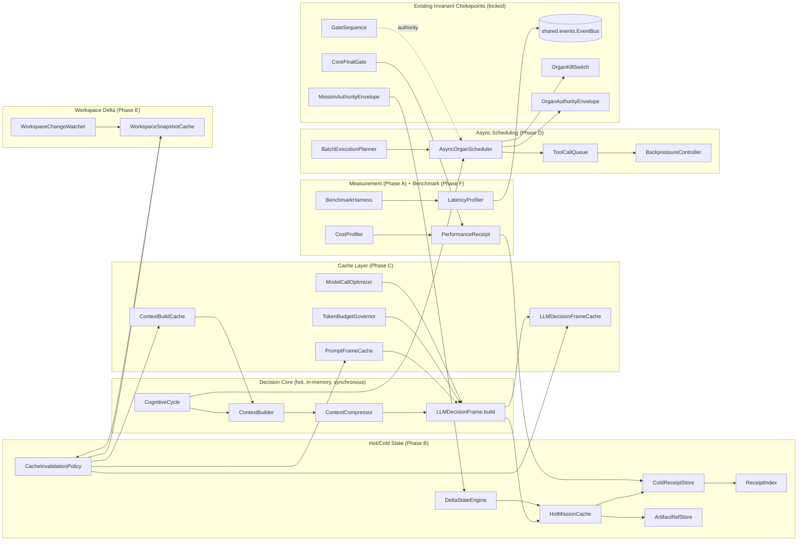
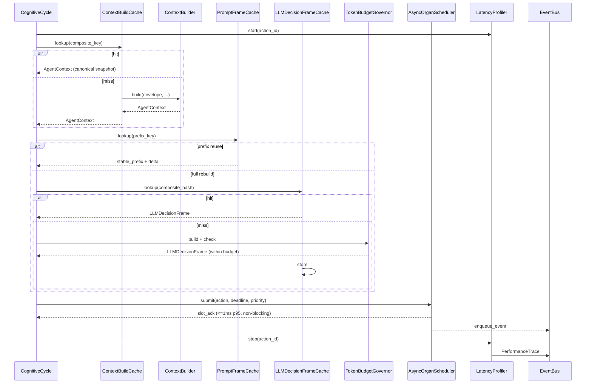

# Design Document — Sentinel Performance Runtime Foundation

## Overview

Sentinel today rebuilds context, rescans workspaces, and blocks the decision core on organ I/O. This spec installs the measurement, cache-correctness, hot/cold state, async scheduling, and benchmark gate foundation that lets Sentinel become a local incremental runtime — without touching authority boundaries, receipt integrity, or the existing FinalGate / GateSequence / Memory-not-Authority chokepoints locked by the `sentinel-full-system-audit` closure.

The design is organised around a single non-negotiable ordering: **measurement first, then structural separation, then caching, then scheduling, then benchmark gates.** No optimisation is introduced before the profiler that would measure it. No cache is introduced without a correctness check that proves it equivalent to a fresh computation. No async scheduler is introduced without the kill-switch, authority, and receipt invariants it has to preserve.

Key design invariants (doctrinal — all are enforced in code and tested):

1. **The decision core SHOULD NOT block on organ I/O after Phase D integration.** Before Phase D (during Phase A/B instrumentation), the existing synchronous behavior of `CognitiveCycle`, `ContextBuilder`, and `ContextCompressor` is preserved; instrumentation must not alter it. Once `AsyncOrganScheduler` + `ToolCallQueue` are installed in Phase D, organ I/O is routed through that non-blocking submission path and the decision core is no longer on the organ I/O critical section.
2. **Hot state holds references; cold storage holds payloads.** `HotMissionCache` never materialises receipts or artifacts in its working set. Receipts round-trip through `ColdReceiptStore` + `ReceiptIndex`; artifacts round-trip through `ArtifactRefStore` keyed by SHA-256.
3. **Caches are equivalent to fresh computation under canonical-form comparison.** `ContextBuildCache`, `PromptFrameCache`, and `LLMDecisionFrameCache` each publish a verifiable equivalence: under `verify_cache_equivalence` diagnostic mode, every hit must match a fresh recompute when both are reduced to their canonical deterministic representation. Volatile fields (e.g., `created_at`, profiling timestamps, non-deterministic iteration order) are excluded or normalised before comparison; `verify_cache_equivalence` compares normalised canonical forms, not raw object bytes.
4. **Caches never expand authority.** `authority_expansion=True`, `raw_secret_leakage=True`, triggered `OrganKillSwitch`, or revoked `MissionAuthorityEnvelope` all force cache bypass. The existing two-line `sanitize_context_text` / `sanitize_context_payload` gate from `LLMDecisionFrame.build` is reused verbatim.
5. **Performance receipts are append-only and secret-free.** `PerformanceReceipt` is a frozen pydantic model. Secret patterns from the canonical sanitizer are rejected at `PerformanceReceipt` construction. `ArtifactRefStore` enforces the artifact-side guarantee described in Phase B (content-hash storage; sanitization only on caller-declared text payloads; no regex scan of binary bytes).
6. **The LatencyProfiler does not change organ call signatures.** It attaches to the existing `EventBus` in `sentinel/shared/events.py`; organs do not know they are instrumented.

Scope is phased A→F per the requirements document. The design below documents every module that each phase introduces and precisely where it plugs into the existing `sentinel/agent/`, `sentinel/mission/`, and `sentinel/organs/` surface.

## Architecture

### System View



### Dataflow — one decision-core tick (hot path, post-installation)



### Layering (who may import whom)

```
measure/  --> shared/events, shared/models, organs/exceptions
hot_cold/ --> measure/, shared/events
caches/   --> hot_cold/, measure/, agent/context_builder, agent/decision_frame, agent/token_ledger
sched/    --> hot_cold/, measure/, shared/events, organs/authority, organs/kill_switch, organs/dry_run
workspace/ --> hot_cold/, shared/events
bench/    --> measure/, hot_cold/, caches/, sched/ (fan-in only; no layer imports bench/)
```

All new modules live under `sentinel/perf/` (a new subpackage of `sentinel-control/services/sentinel-core/sentinel/`) with these sub-modules:

```
sentinel/perf/__init__.py
sentinel/perf/measure/              # Phase A
sentinel/perf/hot_cold/              # Phase B
sentinel/perf/caches/                # Phase C
sentinel/perf/sched/                 # Phase D
sentinel/perf/workspace/             # Phase E
sentinel/perf/bench/                 # Phase F
```

This is a clean additive package. Nothing existing moves. Integration points (listed in Components and Interfaces) are implemented as injection hooks on the existing classes, not as rewrites.

### Phase Sequencing

| Phase | Gated on | Blocks | Rationale |
|-------|----------|--------|-----------|
| A. Measurement | — | B, C, D, E, F | "Optimisation without measurement is superstition." |
| B. Hot/Cold State | A | C, E | Caches need a cold store + index to reference, not duplicate. |
| C. Context & Prompt Cache | A, B | — | Needs receipt/artifact refs (B) and telemetry (A). |
| D. Async Organ Scheduling | A, B | — | Scheduler emits PerformanceReceipts (A) and persists them cold (B). |
| E. Workspace Delta | A, B | — | Delta watcher feeds CacheInvalidationPolicy (B). |
| F. Benchmark Gates | A, B, C, D, E | — | Aggregates p50/p95/p99 across all prior phases. |

## Components and Interfaces

### Phase A — Measurement Foundation

#### `sentinel/perf/measure/performance_trace.py`

> **Naming note:** The requirements glossary refers to `Performance_Trace` for historical readability. The concrete Python/model class is `PerformanceTrace` (CamelCase) for consistency with the rest of Sentinel's model naming (`PerformanceReceipt`, `LLMDecisionFrame`, `OrganExecutionReceipt`, etc.). The event-type enum member `PERFORMANCE_TRACE_EMITTED` retains its screaming-snake-case enum-member style. All other code references — docstrings, diagrams, downstream fields (e.g., `PerformanceReceipt.trace`, `CostProfiler`, `LatencyProfiler`) — use `PerformanceTrace`.

```python
class PerformanceTrace(SentinelModel):
    """Per-action timing/cost record attached to the EventBus.

    Requirements: 1.1, 1.6, 1.7, 12.8
    """
    id: str
    action_id: str
    mission_id: str
    organ_id: str | None
    action_type: str
    queue_wait_ms: int = Field(ge=0)
    wall_ms: int = Field(ge=0)
    cpu_ms: int = Field(ge=0)
    bytes_in: int = Field(ge=0)
    bytes_out: int = Field(ge=0)
    tokens_in: int = Field(ge=0)
    tokens_out: int = Field(ge=0)
    cache_hit: int = Field(ge=0)   # count of hits attributable to the action
    cache_miss: int = Field(ge=0)
    organ_latency_ms: int = Field(ge=0)
    model_prefill_decode_ms: int = Field(ge=0)
    error: bool = False
    error_category: str | None = None  # set when error=True
    severity: str = "info"              # "info" | "warning" | "critical"
    model_config = ConfigDict(frozen=True)  # immutability — Requirement 1.3
```

#### `sentinel/perf/measure/performance_receipt.py`

```python
class PerformanceReceipt(SentinelModel):
    """Append-only, sanitized, frozen receipt for a completed action.

    Requirements: 1.1, 1.2, 1.3, 1.7, 8.6, 9.4, 10.9, 12.1, 12.8
    """
    id: str = Field(default_factory=lambda: new_id("pr"))
    mission_id: str
    action_id: str
    organ_id: str | None = None
    action: str
    trace: PerformanceTrace
    # Cost
    estimated_cost_usd: Decimal = Field(default=Decimal("0"), max_digits=20, decimal_places=6)
    model_id: str | None = None
    # Budget
    budget_remaining: int = Field(ge=0)
    budget_limit: int = Field(ge=0)
    # Cache/scheduling context (optional)
    cache_type: str | None = None      # "context" | "prompt" | "frame" | None
    backpressure_reason: str | None = None
    queue_depth_at_receipt: int | None = None
    # Timeout / cancel
    deadline_ms: int | None = None
    elapsed_ms: int | None = None
    # Safety invariants (never True for a valid receipt)
    authority_expansion: bool = False
    raw_secret_leakage: bool = False
    # Integrity
    receipt_hash: str = ""
    created_at: datetime
    model_config = ConfigDict(frozen=True)

    @model_validator(mode="after")
    def _validate(self) -> PerformanceReceipt:
        if self.authority_expansion:
            raise ValueError("PerformanceReceipt cannot expand authority.")
        # reuses canonical sanitizer (Task 9 sanitize_context_text)
        for field_name, value in _flat_string_fields(self):
            if sanitize_context_text(value) != value:
                raise ValueError(f"PerformanceReceipt contains raw secret in {field_name}")
        expected = self.expected_receipt_hash()
        if self.receipt_hash and self.receipt_hash != expected:
            raise ValueError("PerformanceReceipt hash mismatch.")
        object.__setattr__(self, "receipt_hash", expected)
        return self
```

#### `sentinel/perf/measure/latency_profiler.py`

```python
class LatencyProfiler:
    """Wall+CPU+queue instrumentation; attaches PerformanceTrace to EventBus.

    Requirements: 1.1, 1.5, 1.6, 1.7, 11.*
    """

    def __init__(self, event_bus: EventBus, clock: Callable[[], int] = time.monotonic_ns) -> None: ...

    @contextmanager
    def instrument(self, *, action_id: str, mission_id: str, action_type: str,
                   organ_id: str | None = None) -> Iterator[_TraceHandle]:
        """Synchronous context manager. Use from sync code paths.
        <1ms overhead per call in single-action sequential load.
        Emits PerformanceTrace on context exit, including on exception."""

    @asynccontextmanager
    async def instrument_async(self, *, action_id: str, mission_id: str, action_type: str,
                               organ_id: str | None = None) -> AsyncIterator[_TraceHandle]:
        """Async context manager for async call sites. Same emission contract
        as `instrument`. Use from `async def` paths (scheduler submit,
        model calls, organ calls)."""

    def start(self, *, action_id: str, mission_id: str, action_type: str,
              organ_id: str | None = None) -> _TraceHandle:
        """Explicit start handle for code that cannot use a context manager."""

    def stop(self, handle: _TraceHandle, *, error: bool = False,
             error_category: str | None = None) -> None:
        """Explicit stop; emits PerformanceTrace."""

    def aggregate_mission(self, mission_id: str) -> MissionPerformanceAggregate:
        """Computes p50/p95/p99 from all traces for a mission."""
```

`LatencyProfiler` provides both a synchronous context manager (`instrument`) and an async-compatible surface (`instrument_async` / explicit `start`/`stop`). Async surfaces use identical emission semantics to the sync surface. Scheduler submission paths, model call paths, and organ call paths SHALL use the async-compatible surface; no instrumented path is forced to assume the sync contextmanager shape.

#### `sentinel/perf/measure/cost_profiler.py`

```python
class CostProfiler:
    """Tracks tokens_in, tokens_out, estimated_cost_usd, model_id per model call.

    Requirements: 1.2, 10.9
    """
    def record_model_call(self, *, action_id: str, mission_id: str,
                          model_id: str, tokens_in: int, tokens_out: int) -> PerformanceReceipt: ...
```

#### Integration hooks (Phase A)

| Existing surface | Hook |
|------------------|------|
| `AgentRuntime.__init__` (`sentinel/agent/runtime.py`) | accepts optional `latency_profiler: LatencyProfiler` |
| `AgentRuntime.run` | wraps each phase transition in `latency_profiler.instrument(...)` or `latency_profiler.instrument_async(...)` depending on whether the wrapped call site is sync or async |
| `AgentRuntime._execute_controlled_tool_calls` | wraps each tool call; emits PerformanceTrace to the existing `EventBus` |
| `CognitiveCycle.orient` | instruments the phase transition |
| `ContextBuilder.build`, `ContextCompressor.compress`, `LLMDecisionFrame.build` | instrumented at call boundaries |
| `MissionRunner.run_mission` / `MissionRunner.run_gtm_mission` boundaries (`sentinel/mission/runner.py`) | emit mission-start and mission-end `PerformanceTrace` at the lifecycle entry/exit |
| `MissionRunner._check_revocation` (`sentinel/mission/runner.py`) | MAY emit revocation-check timing ONLY if explicitly instrumented; SHALL NOT be used as the mission start/end lifecycle hook |

The profiler attaches by injection at runtime construction. Organ call signatures are unchanged — Requirement 1.6.

### Phase B — Hot/Cold State Foundation

#### `sentinel/perf/hot_cold/hot_mission_cache.py`

```python
class HotMissionCache:
    """Compact, in-memory, references-only mutable mission state.

    Requirements: 4.1, 4.2, 4.5, 4.6, 4.7, 4.8
    """
    MAX_ACTION_SUMMARIES_PER_MISSION = 10

    def get(self, mission_id: str) -> HotMissionView | None: ...
    def set_objective(self, mission_id: str, objective: str) -> None: ...
    def set_constraints(self, mission_id: str, constraints: list[str]) -> None: ...
    def push_action_summary(self, mission_id: str, summary: ActionSummary) -> None:
        """Keeps last 10; evicts older summaries (returns receipt_id only)."""
    def evict_mission(self, mission_id: str) -> None:
        """Synchronous, same-tick, blocking. Called on mission terminal state."""
    def memory_footprint_bytes(self, mission_id: str) -> int:
        """Used to enforce <64KB (<100 actions), <128KB (up to 1,000), <256KB (>1,000)."""
```

#### `sentinel/perf/hot_cold/cold_receipt_store.py`

```python
class ColdReceiptStore:
    """Append-only durable journal. Receives PerformanceReceipt, OrganExecutionReceipt, OrganDryRunReceipt.

    Requirements: 4.3, 4.4, 5.2, 5.5
    """
    def persist(self, receipt: BaseReceipt) -> ReceiptRef:
        """Persist a receipt and return a ReceiptRef.

        Latency: SHOULD target <=10ms p95 for normal local WAL writes under
        unloaded conditions. This is a target, not a hard guarantee.

        Durability contract:
          - If the WAL (durable staging) write succeeds but final persistence
            exceeds the latency budget, a pending/durable-queue `ReceiptRef`
            MAY be returned. Such a ref is a legitimate persisted reference.
          - If the WAL (durable staging) write fails, NO `ReceiptRef` is
            returned as persisted or pending. The store SHALL emit
            `COLD_STORE_PERSISTENCE_FAILED` and MAY keep only a volatile
            in-memory retry candidate when it is safe to do so. The store
            SHALL NOT claim WAL retention unless the WAL write actually
            succeeded.
          - Retries apply only to entries whose WAL write succeeded but whose
            downstream persistence has not yet completed; retries continue
            until success before the buffered entry is discarded
            (Requirement 4.4)."""

    def load(self, receipt_id: str) -> BaseReceipt: ...
```

#### `sentinel/perf/hot_cold/receipt_index.py`

**Supported indexed compound query shapes:**

- `mission_id` + `timestamp_range`
- `organ_id` + `action_type`
- `entity_path` + `mission_id`
- `content_hash` (point query)
- Any single-dimension subset of the above

Arbitrary N-way intersections outside this set MAY be rejected by `ReceiptIndex.query` or routed to an async/offline query path; the 5 ms p95 benchmark applies ONLY to the supported indexed compound shapes listed above. Correctness guarantees (sort order, truncation to 1000, zero-match returning `[]`, atomicity of persist + index) still apply across all accepted shapes.

```python
class ReceiptIndex:
    """Secondary index over ColdReceiptStore. Transactional with the store.

    Requirements: 5.1, 5.2, 5.3, 5.4, 5.5, 5.6, 5.7, 5.8
    """
    def query(
        self,
        *,
        mission_id: str | None = None,
        organ_id: str | None = None,
        timestamp_range: tuple[datetime, datetime] | None = None,
        action_type: str | None = None,
        entity_path: str | None = None,
        content_hash: str | None = None,
        limit: int = 1000,   # max result set
    ) -> list[str]:
        """Returns receipt_ids sorted by timestamp desc.

        Accepts only the supported indexed compound shapes listed above for
        the 5 ms p95 benchmark (documented in `BenchmarkHarness`). Arbitrary
        N-way intersections outside that set MAY be rejected or routed to an
        async/offline query path. Correctness (ordering, truncation to
        `limit`, zero-match `[]`, persist+index atomicity) applies to all
        accepted shapes regardless of latency class."""
```

#### `sentinel/perf/hot_cold/artifact_ref_store.py`

```python
class ArtifactRefStore:
    """Content-addressed store, keyed by SHA-256. Deduplicates on put.

    Requirements: 6.1, 6.2, 6.3, 6.4, 6.5, 6.6, 6.7, 6.8, 12.4

    Sanitization policy:
        ArtifactRefStore SHALL NOT inline artifact payloads into prompts or
        receipts; artifacts are always referenced by content hash. For text
        artifacts explicitly declared LLM-exposable by the caller
        (content_type='text' and llm_exposable=True), the store SHALL apply
        the canonical `sanitize_context_text` / `sanitize_context_payload`
        gate before the artifact may be surfaced to any downstream
        prompt-rendering path. Binary artifacts SHALL be stored by content
        hash reference only and SHALL NOT be scanned as text unless the
        caller explicitly decodes the payload as text and re-submits it
        through the text-artifact path.
    """
    MAX_ARTIFACT_BYTES = 10 * 1024 * 1024

    def put(
        self,
        payload: bytes,
        *,
        content_type: str = "binary",   # "binary" | "text"
        llm_exposable: bool = False,
    ) -> ArtifactRef:
        """Store an artifact by its SHA-256 content hash.

        - SHA-256 content hash is the key; identical payloads deduplicate
          (Requirement 6.2).
        - Rejects submissions where len(payload) > MAX_ARTIFACT_BYTES with an
          ARTIFACT_REJECTED event (Requirement 6.7).
        - On storage resource exhaustion, rejects explicitly and SHALL NOT
          create a partial/corrupt entry (Requirement 6.8).
        - Does NOT regex-scan arbitrary binary payloads for secret patterns.
          When content_type='text' AND llm_exposable=True, runs canonical
          sanitization on the decoded text before the artifact becomes
          exposable downstream; if sanitization detects a secret pattern,
          the artifact is rejected with an ARTIFACT_REJECTED event
          (Requirement 12.4). Binary artifacts are stored by hash without
          text scanning."""

    def get(self, content_hash: str) -> bytes:
        """Recomputes hash on read; raises ArtifactIntegrityError on mismatch (Requirement 6.6).
        <=5ms for stores <=10,000 artifacts."""
```

#### `sentinel/perf/hot_cold/delta_state_engine.py`

```python
class DeltaStateEngine:
    """Applies validated deltas on top of HotMissionCache, never a full rebuild.

    Requirements: 12.7 (authority-bounds enforcement)
    """
    def apply(self, mission_id: str, delta: StateDelta, envelope: MissionAuthorityEnvelope) -> None:
        """Rejects deltas that would exceed envelope bounds, emits AUTHORITY_VIOLATION."""
```

#### `sentinel/perf/hot_cold/cache_invalidation_policy.py`

```python
class CacheInvalidationPolicy:
    """Dependency-graph-primary invalidation with TTL upper bounds.

    Requirements: 3.1, 3.2, 3.3, 3.4, 3.5, 3.6
    """
    TTL_WORKSPACE_SNAPSHOT_S = 300
    TTL_EVIDENCE_SELECTION_S = 600
    TTL_PROMPT_FRAME_S = 600
    TTL_DECISION_FRAME_S = 600
    BULK_EVICTION_WARN_THRESHOLD = 1000

    def register_dependency(self, parent: CacheKey, child: CacheKey) -> None: ...
    def invalidate(self, key: CacheKey, *, cause: InvalidationCause) -> InvalidationResult:
        """Dependency-graph traversal; same-tick completion.
        Emits BULK_EVICTION_WARNING only for cause==INVALIDATION_EVENT and count>1000."""
```

### Phase C — Context and Prompt Cache Foundation

#### Cache immutability and defensive-copy rule

**Cache immutability and defensive-copy rule.** Every cache under `sentinel/perf/caches/` (`ContextBuildCache`, `PromptFrameCache`, `LLMDecisionFrameCache`) SHALL either (a) store only frozen / immutable canonical entries, or (b) return defensive deep copies for mutable models. No caller may mutate the canonical cached object. Concretely:

- `LLMDecisionFrame` is already frozen (`ConfigDict(frozen=True)`); cache stores it as-is and returns the frozen reference.
- `AgentContext` and other mutable pydantic models SHALL be stored as frozen canonical snapshots; if storage as frozen is not possible, `get_or_build`/`get_or_render` returns `model.model_copy(deep=True)` to the caller.
- Prompt text strings and hashes are immutable by construction.
- Any violation of this rule invalidates the cache correctness property (Property 3) and SHALL cause a cache correctness violation to be emitted.

The `(canonical snapshot)` annotation on the cache-return arrow in the decision-core dataflow sequence diagram reflects this rule: what the cache hands back is either the frozen canonical entry itself or a deep copy — never a live reference that could be mutated to poison future hits.

#### `sentinel/perf/caches/context_build_cache.py`

```python
class ContextBuildCache:
    """Caches the output of ContextBuilder.build by composite key.

    Requirements: 2.1, 2.4, 2.5, 2.6, 3.1

    Equivalence scope: byte-identical equivalence to a fresh computation
    applies to the canonical deterministic representation of the cached
    AgentContext (sorted keys, normalised whitespace, volatile fields such
    as `created_at` or profiling timestamps excluded). `verify_cache_equivalence`
    compares normalised canonical forms, not raw object bytes.
    """
    def composite_key(
        self,
        *,
        mission_hot_hash: str,
        workspace_snapshot_id: str,
        organ_state_hash: str,
        authority_hash: str,
    ) -> CacheKey: ...

    def get_or_build(
        self,
        key: CacheKey,
        builder: Callable[[], AgentContext],
        *,
        verify: bool = False,   # verify_cache_equivalence diagnostic mode
    ) -> AgentContext: ...
```

#### `sentinel/perf/caches/prompt_frame_cache.py`

```python
class PromptFrameCache:
    """Caches rendered prompt text keyed by frame_hash.

    Requirements: 2.2, 2.6, 9.3

    Equivalence scope: cached rendered prompt text is compared against a fresh
    render under canonical-form equivalence — identical `frame_hash` and
    identical rendered string after normalisation of volatile fields (e.g.,
    profiling timestamps, non-deterministic iteration order). Raw object-byte
    comparison is not used.
    """
    def get_or_render(
        self,
        frame: LLMDecisionFrame,
        renderer: Callable[[LLMDecisionFrame], str],
        *,
        verify: bool = False,
    ) -> str: ...

    def reuse_prefix(
        self,
        stable_prefix_hash: str,
        evidence_delta: list[EvidenceCard],
    ) -> str | None:
        """Append-only delta reuse. Requirement 9.3."""
```

#### `sentinel/perf/caches/llm_decision_frame_cache.py`

```python
class LLMDecisionFrameCache:
    """Caches full LLMDecisionFrame instances.

    Requirements: 2.3, 2.6, 9.1, 9.2, 9.4, 9.5, 9.6, 9.7, 12.2, 12.3

    Equivalence scope: a cached LLMDecisionFrame is considered equivalent to
    a fresh build when, after reduction to its canonical deterministic
    representation, it passes `DecisionFrameVerifier` identically to the fresh
    build. Volatile fields (e.g., `created_at`, profiling timestamps,
    non-deterministic iteration order) are excluded or normalised before
    comparison; the comparison is over canonical form, not raw object bytes.
    """
    MAX_ENTRIES_PER_MISSION = 128

    def composite_hash(
        self,
        *,
        mission_hot_hash: str,
        authority_hash: str,
        evidence_set_hash: str,
        tool_surface_hash: str,
    ) -> str: ...

    def get(self, composite: str) -> LLMDecisionFrame | None:
        """Returns None if:
          * composite miss
          * TTL expired (Requirement 9.7)
          * raw_secret_leakage=True (Requirement 12.3)
          * authority_expansion=True (Requirement 12.2)
        Increments the correct counter (hit/miss/eviction) per Requirement 9.4."""

    def put(self, composite: str, frame: LLMDecisionFrame) -> None:
        """Rejects authority_expansion=True writes (Requirement 12.2)."""

    def stats(self, mission_id: str) -> CacheStats:
        """Per-mission hit/miss/eviction counts surfaced in mission PerformanceReceipt."""
```

#### `sentinel/perf/caches/token_budget_governor.py`

```python
class TokenBudgetGovernor:
    """Hard token limits: per-frame, per-action, per-mission.

    Requirements: 10.1, 10.2, 10.3, 10.4, 10.5, 10.6, 10.7, 10.8, 10.9
    """
    MAX_COMPRESSION_PASSES = 3

    def enforce_frame(
        self,
        frame_builder: Callable[[], LLMDecisionFrame],
        compressor: ContextCompressor,
        *,
        frame_budget: int,           # 0 < frame_budget <= context_window_tokens
    ) -> LLMDecisionFrame: ...

    def enforce_action(self, action: PlannedAction, *, action_budget: int) -> None: ...
    def enforce_mission(self, mission_id: str, *, mission_budget: int) -> BudgetCheckResult: ...
```

#### `sentinel/perf/caches/model_call_optimizer.py`

```python
class ModelCallOptimizer:
    """Selects runtime/model/backend and prefix reuse strategy.

    Requirements: 9.3, 11.6
    """
    def plan(self, frame: LLMDecisionFrame, ledger: TokenLedger) -> ModelCallPlan: ...
```

### Phase D — Async Organ Scheduling

#### `sentinel/perf/sched/async_organ_scheduler.py`

```python
class AsyncOrganScheduler:
    """Event-loop-based submission/completion scheduler.

    Requirements: 7.1, 7.2, 7.3, 7.4, 7.5, 7.6, 7.8, 12.5
    """
    class Priority(IntEnum):
        CRITICAL = 0
        NORMAL = 1
        LOW = 2

    def __init__(
        self,
        *,
        event_bus: EventBus,
        latency_profiler: LatencyProfiler,
        cold_store: ColdReceiptStore,
        authority_evaluator: OrganAuthorityEvaluator,
    ) -> None: ...

    async def submit(
        self,
        action: OrganAction,
        *,
        authority: OrganAuthorityEnvelope,
        kill_switch: OrganKillSwitch,
        dry_run: OrganDryRunReceipt,
        deadline_ms: int,
        priority: Priority = Priority.NORMAL,
    ) -> SubmissionAck:
        """Enqueue an organ action and return an acknowledgement.

        Latency: SHOULD target <=1ms p95 under unloaded local conditions;
        this is a target, not a hard guarantee.

        Non-blocking contract: SHALL remain non-blocking with respect to
        organ execution — the caller is never blocked on organ I/O, only on
        the bounded enqueue step. Under backpressure, `submit` still returns
        promptly either with a queued SubmissionAck or with a backpressure
        rejection; it never awaits organ completion.

        Rejects with KILL_SWITCH_BLOCKED if kill_switch.triggered or
        execution_allowed=False. Rejects with AUTHORITY_DENIED if
        authority.execution_authorized=False."""

    def cancel_mission(self, mission_id: str) -> int:
        """Cancels all queued + in-flight; emits cancellation PerformanceReceipt per action."""
```

#### `sentinel/perf/sched/tool_call_queue.py`

```python
class ToolCallQueue:
    """Priority queue with deadline, estimated cost, cancellation.

    Requirements: 7.7, 8.1, 8.2
    """
    def depth(self) -> int: ...
    def estimated_wait_ms(self) -> int: ...
    def per_organ_concurrency(self) -> dict[str, int]: ...
    def enqueue(self, item: QueuedAction) -> EnqueueOutcome: ...
    def dequeue(self) -> QueuedAction: ...
```

#### `sentinel/perf/sched/batch_execution_planner.py`

```python
class BatchExecutionPlanner:
    """Fuses safe read-only operations (file reads, HEAD requests, metadata).

    Requirements: implicit (scheduling efficiency).
    """
    def plan(self, actions: list[OrganAction]) -> list[OrganActionBatch]: ...
```

#### `sentinel/perf/sched/backpressure_controller.py`

```python
class BackpressureController:
    """Concurrency limits, token budgets, byte budgets, timeouts, bounded queue depths.

    Requirements: 8.1-8.7, 12.6
    """
    def check_submission(
        self,
        action: OrganAction,
        *,
        envelope: MissionAuthorityEnvelope,
    ) -> BackpressureDecision:
        """Never increases any field above envelope (Requirement 12.6)."""

    def note_enqueue(self, action: OrganAction) -> None: ...
    def note_dequeue(self, action: OrganAction) -> None: ...
    def sliding_byte_rate(self, organ_id: str) -> int:  # bytes in 1s window
        ...
```

### Phase E — Workspace Delta

#### `sentinel/perf/workspace/workspace_change_watcher.py`

```python
class WorkspaceChangeWatcher:
    """Native fs watcher (watchdog / ReadDirectoryChangesW) with poll fallback.

    Requirements: 3.2
    """
    def start(self, root: Path) -> None: ...
    def events(self) -> Iterator[WorkspaceDelta]:  # CREATED | MODIFIED | RENAMED | DELETED
        ...
```

#### `sentinel/perf/workspace/workspace_snapshot_cache.py`

```python
class WorkspaceSnapshotCache:
    """Incremental view driven by WorkspaceChangeWatcher deltas.

    Requirements: 3.2, 3.4
    """
    def snapshot_id(self) -> str:
        """Changes only when deltas apply."""
    def apply_delta(self, delta: WorkspaceDelta) -> None:
        """Propagates invalidation to CacheInvalidationPolicy."""
```

### Phase F — Benchmark Regression Gates

#### `sentinel/perf/bench/golden_missions.py`

```python
GOLDEN_MISSION_CLASSES = [
    GoldenMission("startup",       min_iterations=30, p50_budget_ms=150, p95_budget_ms=400, p99_budget_ms=800),
    GoldenMission("single_tool",   min_iterations=30, p50_budget_ms=200, p95_budget_ms=500, p99_budget_ms=1000),
    GoldenMission("multi_tool",    min_iterations=30, p50_budget_ms=400, p95_budget_ms=1000, p99_budget_ms=2000),
    GoldenMission("browser_heavy", min_iterations=30, p50_budget_ms=800, p95_budget_ms=2000, p99_budget_ms=4000),
]
```

#### `sentinel/perf/bench/harness.py`

```python
class BenchmarkHarness:
    """Runs golden missions, computes p50/p95/p99, enforces gates.

    Requirements: 11.1-11.9
    """
    P95_FAIL_TOLERANCE = 1.10
    P99_FAIL_TOLERANCE = 1.15

    def run(self) -> BenchmarkReport:
        """Blocks until all golden missions complete (Requirement 11.3)."""

    def evaluate_gates(self, report: BenchmarkReport) -> GateVerdict: ...
```

### Integration with Existing Modules (wiring)

| Existing module | Integration (this spec) |
|-----------------|------------------------|
| `sentinel/agent/runtime.py` (`AgentRuntime`) | constructor accepts `latency_profiler`, `cost_profiler`, `async_organ_scheduler` (all optional; defaults preserve current behaviour) |
| `sentinel/agent/cognitive_cycle.py` | accepts an injected profiler handle; no signature change to `orient` |
| `sentinel/agent/context_builder.py` (`ContextBuilder.build`) | wrapped by `ContextBuildCache.get_or_build(...)` at the runtime call site, not inside `build` itself |
| `sentinel/agent/context_compressor.py` (`ContextCompressor.compress`) | invoked by `TokenBudgetGovernor.enforce_frame` |
| `sentinel/agent/decision_frame.py` (`LLMDecisionFrame.build`) | wrapped by `LLMDecisionFrameCache.get()` then `put()` at the call site |
| `sentinel/agent/token_ledger.py` | feeds `CostProfiler.record_model_call` and `TokenBudgetGovernor.enforce_mission` |
| `sentinel/agent/prompt_budget.py` | becomes the source of `frame_budget` for `TokenBudgetGovernor.enforce_frame` |
| `sentinel/organs/receipts.py` (`OrganExecutionReceipt`) | persisted to `ColdReceiptStore`; indexed by `ReceiptIndex` |
| `sentinel/organs/dry_run.py` (`OrganDryRunReceipt`) | consumed by `AsyncOrganScheduler.submit(dry_run=...)` |
| `sentinel/organs/kill_switch.py` (`OrganKillSwitch`) | checked by `AsyncOrganScheduler.submit` before enqueue; Requirement 12.5 |
| `sentinel/organs/contracts.py` (`OrganAuthorityEnvelope` et al.) | read by `AsyncOrganScheduler` and `BackpressureController`; never written |
| `sentinel/shared/events.py` (`EventBus`, `AgentEventType`) | profiler emits new event types (see Data Models) |
| `sentinel/mission/runner.py` (`MissionRunner`) | constructs `HotMissionCache`; drives eviction on terminal state |
| `sentinel/mission/reviewer.py` (`ReviewerLite`) | unchanged; artifacts referenced through `ArtifactRefStore` by hash when available |
| `sentinel/agent/final_gate.py` (`CoreFinalGate`) | verifies ONLY minimal cross-cutting `PerformanceReceipt` invariants before mission close: (a) no authority expansion (`authority_expansion=False`), (b) no raw secret leakage marker (`raw_secret_leakage=False`), (c) receipt hash validity. Detailed performance-budget failures (p95/p99 regressions, latency budget overages) belong to `BenchmarkHarness` (Phase F), NOT `CoreFinalGate`. |

Existing public behavior is preserved. Some constructors receive additive optional parameters with safe defaults (e.g., `latency_profiler`, `cost_profiler`, `async_organ_scheduler` on `AgentRuntime.__init__`); defaults reproduce current behavior exactly. No existing required parameter, return type, or method signature is changed. The integration is additive — by injection or by wrapping at the call site — never by rewriting existing surfaces.

## Data Models

### New EventBus event types

Added to `AgentEventType` in `sentinel/shared/events.py`. **Additivity invariant:** event additions are additive only; existing members are neither renamed nor renumbered. Additions are grouped into families for clarity: Performance, Cache, Queue/Backpressure, Budget, Artifact, Authority/KillSwitch, Organ-Action. Future additions MUST preserve this grouping and additivity.

```
# --- Performance family ---
PERFORMANCE_TRACE_EMITTED
PERFORMANCE_RECEIPT_RECORDED

# --- Cache family ---
CACHE_HIT
CACHE_MISS
CACHE_EVICTED
CACHE_CORRECTNESS_VIOLATION        # Requirement 2.5
CACHE_INVALIDATION_BULK_WARNING    # Requirement 3.6

# --- Receipt/Cold-Store family ---
COLD_STORE_PERSISTENCE_FAILED      # Requirement 4.4
RECEIPT_INDEX_INCONSISTENCY        # Requirement 5.7
RECEIPT_INDEX_HEALTH_CHECK         # Requirement 5.8

# --- Artifact family ---
ARTIFACT_INTEGRITY_ERROR           # Requirement 6.6
ARTIFACT_REJECTED                  # Requirement 6.7, 6.8, 12.4
                                    # (size overflow, resource exhaustion,
                                    #  or — for text+llm_exposable artifacts
                                    #  only — canonical-sanitizer rejection)

# --- Queue / Backpressure family ---
QUEUE_BACKPRESSURE_APPLIED         # Requirement 8.2, 8.6
QUEUE_BACKPRESSURE_CLEARED         # Requirement 8.7

# --- Budget family ---
BUDGET_WARNING                     # Requirement 10.8
BUDGET_EXCEEDED                    # Requirement 10.3, 10.5
BUDGET_EXHAUSTED                   # Requirement 8.4, 10.7

# --- Organ-Action family ---
ORGAN_ACTION_TIMEOUT               # Requirement 7.4
ORGAN_ACTION_FAILED                # Requirement 7.5
ORGAN_ACTION_CANCELLED             # Requirement 7.8

# --- Authority / KillSwitch family ---
AUTHORITY_VIOLATION                # Requirement 12.7
KILL_SWITCH_BLOCKED                # Requirement 12.5
```

### Composite keys and hashes

All composite keys are SHA-256 over the canonical JSON of their components (matching the `_stable_hash` pattern in `sentinel/agent/decision_frame.py:14`):

```python
def _stable_hash(payload: dict) -> str:
    return hashlib.sha256(
        json.dumps(payload, sort_keys=True, separators=(",", ":"), ensure_ascii=True).encode("utf-8")
    ).hexdigest()
```

| Key | Components |
|-----|------------|
| `ContextBuildCache` composite | `{mission_hot_hash, workspace_snapshot_id, organ_state_hash, authority_hash}` |
| `PromptFrameCache` key | `frame_hash` (from `LLMDecisionFrame.frame_hash`) |
| `LLMDecisionFrameCache` composite | `{mission_hot_hash, authority_hash, evidence_set_hash, tool_surface_hash}` |
| `WorkspaceSnapshotCache.snapshot_id` | hash of sorted `(path, mtime_ns, size, content_sha256)` tuples |
| `mission_hot_hash` | hash of sorted `(objective, constraints, active_blockers, organ_states)` |
| `authority_hash` | hash of `MissionAuthorityEnvelope` model dump |
| `evidence_set_hash` | hash of sorted `EvidenceCard.receipt_id` list |
| `tool_surface_hash` | hash of sorted `selected_tool_surface` |

### `HotMissionView` (in-memory)

```python
class HotMissionView(SentinelModel):
    mission_id: str
    objective: str
    constraints: list[str]                                  # cap: 32 entries
    active_blockers: list[str]                              # cap: 16 entries
    organ_states: dict[str, OrganStateRef]                  # cap: 32 organs; ref only
    recent_action_summaries: list[ActionSummaryRef]         # cap: 10 (Requirement 4.1, 4.8)
    receipt_refs: list[str]                                 # by id only (Requirement 4.2)
```

Footprint targets (Requirement 4.5) are enforced by bounded data structures. A 256-byte upper bound per `ActionSummaryRef` × 10 = 2.5 KB worst case for recent summaries; the remainder is consumed by objective (cap 2 KB), constraints (cap 512 bytes × 32 = 16 KB), blockers (cap 512 bytes × 16 = 8 KB), organ states (cap 512 bytes × 32 = 16 KB), yielding <64 KB for <100 actions as required. `memory_footprint_bytes` returns an implementation-defined deep-size estimate calibrated by tests to be within a bounded error of the true in-memory footprint; the specific estimator is an implementation detail (no hard dependency on `pympler`), and tests validate upper-bound accuracy against the thresholds in Requirement 4.5.

### `ReceiptIndex` schema

Physical store: a single SQLite database with these indexes. SQLite is chosen because (a) it is transactional with the same file that can hold `ColdReceiptStore`'s journal — satisfying Requirement 5.2's "same write transaction", (b) it is the default durable store already available in Sentinel's CI environment, and (c) PBT-friendly benchmarks show sub-millisecond point queries for <=100k rows.

```sql
CREATE TABLE receipt (
    id TEXT PRIMARY KEY,
    mission_id TEXT NOT NULL,
    organ_id TEXT,
    action_type TEXT NOT NULL,
    entity_path TEXT,
    content_hash TEXT,
    ts_ns INTEGER NOT NULL,
    payload BLOB NOT NULL            -- canonical JSON of the receipt
);
CREATE INDEX ix_receipt_mission_ts ON receipt(mission_id, ts_ns DESC);
CREATE INDEX ix_receipt_organ_action ON receipt(organ_id, action_type, ts_ns DESC);
CREATE INDEX ix_receipt_entity_mission ON receipt(entity_path, mission_id, ts_ns DESC);
CREATE INDEX ix_receipt_content ON receipt(content_hash);
```

All queries in `ReceiptIndex.query(...)` use these indexes; compound queries combine predicates under the leading index. A hard `LIMIT 1000` is enforced in SQL, matching Requirement 5.3.

### `ArtifactRef`

```python
class ArtifactRef(SentinelModel):
    id: str              # "artifact://<sha256>"
    sha256: str          # 64 hex chars
    size_bytes: int = Field(ge=0, le=10 * 1024 * 1024)
    stored_at: datetime
    model_config = ConfigDict(frozen=True)
```

The content is stored blob-on-disk at `<artifact_root>/<sha256[0:2]>/<sha256>`, never in any receipt or decision-frame inline field.

### `MissionPerformanceAggregate`

```python
class MissionPerformanceAggregate(SentinelModel):
    mission_id: str
    action_count: int
    p50_ms: int
    p95_ms: int
    p99_ms: int           # identical to p50 when action_count < 2 (Requirement 1.4)
    cache_stats: dict[str, CacheStats]   # per cache_type
    total_tokens_in: int
    total_tokens_out: int
    total_cost_usd: Decimal
    model_config = ConfigDict(frozen=True)
```

### `GoldenMission` and `BenchmarkReport`

```python
class GoldenMission(SentinelModel):
    name: str
    min_iterations: int = Field(ge=30)
    p50_budget_ms: int
    p95_budget_ms: int
    p99_budget_ms: int

class BenchmarkReport(SentinelModel):
    started_at: datetime
    completed_at: datetime | None          # None until the run completes (Requirement 11.3)
    iteration_count: int
    per_mission: dict[str, MissionPerformanceAggregate]
    passed: bool

class GateVerdict(SentinelModel):
    passed: bool
    p95_regressions: list[GateRegression]  # >10% over budget → fail
    p99_regressions: list[GateRegression]  # >15% over budget → fail
```

## Correctness Properties

*A property is a characteristic or behavior that should hold true across all valid executions of a system — essentially, a formal statement about what the system should do. Properties serve as the bridge between human-readable specifications and machine-verifiable correctness guarantees.*

The properties below are universally quantified ("for all" / "for any") and are written so that each can be realised as a single property-based test. Latency SLAs (p95 / p99 targets) are not encoded as property-based tests; they are captured as benchmark assertions in the `BenchmarkHarness` (Phase F) and cross-referenced where they complement a property.

### Property 1: PerformanceTrace shape is total and non-negative

*For any* instrumented action (completing normally, failing, or timing out), the `PerformanceTrace` emitted by `LatencyProfiler` on context exit (or on explicit `stop` for `start`/`stop` code paths, and equally for the `instrument` sync context manager, the `instrument_async` async context manager, and the explicit `start`/`stop` pair) SHALL contain all eleven numeric fields (`queue_wait_ms`, `wall_ms`, `cpu_ms`, `bytes_in`, `bytes_out`, `tokens_in`, `tokens_out`, `cache_hit`, `cache_miss`, `organ_latency_ms`, `model_prefill_decode_ms`) as non-negative integers, with fields not applicable to the action type recorded as `0`; for failing actions, `error=True` and `error_category` is set; for any safety-invariant violation the trace is emitted with `severity='critical'` and contains no raw secret substrings.

**Validates: Requirements 1.1, 1.7, 10.9, 12.8**

### Property 2: PerformanceReceipt is append-only and immutable

*For any* successfully constructed `PerformanceReceipt`, any attempt to mutate any of its fields SHALL raise and leave the receipt unchanged; the mission-level aggregate produced by `LatencyProfiler.aggregate_mission` SHALL satisfy `p50 == p95 == p99` whenever `action_count < 2`, and otherwise `p50 <= p95 <= p99`.

**Validates: Requirements 1.3, 1.4**

### Property 3: Cache canonical-form equivalence and correctness fallback

*For any* cache (`ContextBuildCache`, `PromptFrameCache`, `LLMDecisionFrameCache`) and any composite-key-equivalent pair (cached entry, fresh recomputation), their canonical deterministic representations SHALL be equal (`DecisionFrameVerifier` agreement for decision frames; `frame_hash` equality for prompt frames; normalised `AgentContext` equality for context builds); under `verify_cache_equivalence` diagnostic mode any detected divergence SHALL cause eviction, emission of `CACHE_CORRECTNESS_VIOLATION` carrying `(cache_type, composite_key, mismatch_description)`, and return of the fresh recomputation without a second recompute; at runtime, any cache result failing its correctness check SHALL be discarded and replaced by a fresh computation.

**Validates: Requirements 2.1, 2.2, 2.3, 2.4, 2.5, 2.6**

### Property 4: Cache invalidation dependency closure

*For any* change to any composite-key component (`mission_hot_hash`, `workspace_snapshot_id`, `organ_state_hash`, `authority_hash`) or to any referenced workspace path (create, modify, rename, delete), `CacheInvalidationPolicy` SHALL evict every entry whose key transitively depends on the changed component — across `ContextBuildCache`, `WorkspaceSnapshotCache`, `PromptFrameCache`, `LLMDecisionFrameCache` — within the same event-loop tick; any access to an invalidated-but-not-yet-evicted entry SHALL return a cache miss rather than stale data; TTL expiry (workspace 300s, evidence/prompt/decision 600s) SHALL evict entries regardless of dependency state; `CACHE_INVALIDATION_BULK_WARNING` SHALL be emitted if and only if the invalidation cause is an invalidation event (not TTL) and the eviction count exceeds 1000 in one pass.

**Validates: Requirements 3.1, 3.2, 3.3, 3.4, 3.5, 3.6**

### Property 5: Cold-store durability — no-loss round-trip under failure

*For any* sequence of `ColdReceiptStore.persist(receipt)` calls interleaved with injected transient persistence failures, every receipt whose call returned a `ReceiptRef` SHALL have had its WAL (durable staging) write succeed before the ref was returned, and SHALL be durably recoverable via `load(ref.id)` after any finite number of retries with contents round-tripping byte-for-byte under canonical encoding; no `ReceiptRef` (neither persisted nor pending) SHALL be returned when the WAL write failed; every persistence failure SHALL emit `COLD_STORE_PERSISTENCE_FAILED`; retries SHALL apply only to entries whose WAL write succeeded but whose downstream persistence has not yet completed, and SHALL continue until success before the buffered entry is discarded.

**Validates: Requirements 4.3 (durability contract; the <=10ms p95 target is covered by BenchmarkHarness), 4.4**

### Property 6: Hot/cold size bounds and overflow round-trip

*For any* mission and any sequence of action summaries pushed into `HotMissionCache`, the cache SHALL retain at most 10 recent summaries, every additional summary SHALL be replaced in the hot view by its receipt id and recoverable via `ReceiptIndex.query`/`ColdReceiptStore.load`, no receipt or artifact payload bytes SHALL appear in the hot view (only ids), `memory_footprint_bytes(mission_id)` SHALL remain below the tier threshold (<64 KB for <100 completed actions, <128 KB for <=1000, <256 KB for >1000), and on mission terminal state the entire mission's hot entries SHALL be evicted synchronously within the same tick.

**Validates: Requirements 4.1, 4.2, 4.5, 4.7, 4.8**

### Property 7: ReceiptIndex query semantics and atomicity

*For any* sequence of `ColdReceiptStore.persist` + `ReceiptIndex.query` operations (possibly with injected failures between the two), either both the receipt and all its index entries are committed or neither is (no orphaned receipts, no dangling index entries); *for any* accepted query shape — single-dimension (`mission_id`, `organ_id`, `timestamp_range`, `action_type`, `entity_path`, `content_hash`) or any of the supported indexed compound shapes (`mission_id`+`timestamp_range`, `organ_id`+`action_type`, `entity_path`+`mission_id`, `content_hash` point query) — against a store of N receipts, the returned list SHALL equal the in-memory AND-filtered ground truth truncated to 1000 entries and sorted by timestamp descending, zero-match queries SHALL return `[]`, and any detected index/store inconsistency SHALL cause the inconsistent entry to be excluded and a source-tagged diagnostic (`query_inconsistency` | `health_check` | `index_rebuild`) to be emitted; compound query shapes outside the supported indexed set are outside the scope of this property and MAY be rejected by the store.

**Validates: Requirements 5.1, 5.2, 5.3 (cap; the 5 ms p95 benchmark for indexed compound shapes lives in BenchmarkHarness), 5.4 (indexed compound shapes only), 5.5, 5.6, 5.7, 5.8**

### Property 8: ArtifactRefStore SHA-256 round-trip, dedup, and integrity

*For any* payload `p` with `len(p) <= 10 MB`, `put(p).sha256 == SHA256(p)`, `get(put(p).sha256) == p`, and a subsequent `put(p)` returns the existing ref without creating a duplicate on-disk entry; if the on-disk content is corrupted (hash mismatch on read), `get` raises an integrity error and leaves the stored bytes unchanged and emits `ARTIFACT_INTEGRITY_ERROR`; payloads exceeding 10 MB or submitted under storage exhaustion are rejected with `ARTIFACT_REJECTED` and never create partial entries; *for any* text payload explicitly submitted with `content_type='text'` and `llm_exposable=True` that contains a canonical-sanitizer-detected secret pattern, `put` SHALL reject with `ARTIFACT_REJECTED`; binary payloads (or text without `llm_exposable=True`) SHALL NOT be regex-scanned for secret patterns.

**Validates: Requirements 6.1, 6.2, 6.4, 6.5, 6.6, 6.7, 6.8, 12.4**

### Property 9: Scheduler non-blocking + outcome-event correctness + kill-switch/authority enforcement

*For any* organ action submitted to `AsyncOrganScheduler.submit`, the caller SHALL NOT be blocked on organ execution (submit returns either a `SubmissionAck` or a rejection without awaiting organ completion); the event subsequently delivered for that action SHALL match its actual outcome — success → success completion event (only when the organ actually succeeded), deadline exceeded → timeout `PerformanceReceipt` with `(organ_id, action, deadline_ms, elapsed_ms)` and slot released, failure → failure `PerformanceReceipt` with `(organ_id, action, error_category)` plus a failure completion event, mission abort → a cancellation `PerformanceReceipt` per cancelled action; submission SHALL be rejected with `KILL_SWITCH_BLOCKED` when the kill switch is triggered or `execution_allowed=False`, and with `AUTHORITY_DENIED` when `execution_authorized=False`; and higher-priority queued actions SHALL execute before lower-priority ones in the same queue.

**Validates: Requirements 7.1 (non-blocking contract; 1ms p95 is BenchmarkHarness), 7.2, 7.3, 7.4, 7.5, 7.6, 7.7, 7.8, 12.5**

### Property 10: Backpressure lifecycle never expands authority

*For any* `MissionAuthorityEnvelope` and any load of submissions, every `BackpressureDecision` produced by `BackpressureController` SHALL have all bounds (token budgets, byte budgets, concurrency limits, permission scopes) less-than-or-equal-to the corresponding envelope fields; queue-depth overflow SHALL reject with a backpressure signal containing `(organ_type, queue_depth, estimated_wait_ms)`; byte-rate is enforced over a 1 s sliding window per organ; every backpressure application SHALL record a `PerformanceReceipt` carrying `(reason, queue_depth, budget_remaining)` and emit `QUEUE_BACKPRESSURE_APPLIED`; `QUEUE_BACKPRESSURE_CLEARED` SHALL be emitted if and only if both backpressure has actually cleared and the queue depth is below its configured bound.

**Validates: Requirements 8.1, 8.2, 8.3, 8.4, 8.5, 8.6, 8.7, 12.6**

### Property 11: Decision-frame cache lifecycle and prefix reuse

*For any* sequence of `LLMDecisionFrameCache` operations, a lookup within TTL for a composite hash that has been previously stored SHALL return the cached frame and skip the `ContextBuilder` pipeline; LRU eviction SHALL preserve the 128 most-recently-used entries per mission and evict strictly older ones when the cap is exceeded; TTL expiry or any change in `authority_hash` SHALL invalidate affected entries and force rebuild; hit/miss/eviction counters reported via `stats(mission_id)` SHALL equal the ground-truth counts of each event type; and when only the evidence delta changes between consecutive frames, `PromptFrameCache.reuse_prefix(stable_prefix_hash, evidence_delta)` SHALL produce a rendered prompt string equal to a full rebuild of the same frame.

**Validates: Requirements 9.1, 9.2, 9.3, 9.4, 9.5, 9.6, 9.7**

### Property 12: Token-budget enforcement at frame, action, and mission scope

*For any* frame build request with `0 < frame_budget <= context_window_tokens`, `TokenBudgetGovernor.enforce_frame` SHALL invoke evidence compression at most 3 times and return a frame whose token count is `<= frame_budget`, otherwise reject the frame and emit `BUDGET_EXCEEDED`; *for any* planned action, `enforce_action` SHALL reject (pre-execution) when `tokens_in + tokens_out > action_budget` and emit `BUDGET_EXCEEDED`; *for any* mission with positive `mission_budget`, cumulative token consumption reaching or exceeding the budget SHALL block new model calls and emit `BUDGET_EXHAUSTED` while allowing in-flight calls to complete, and crossing the 90% threshold SHALL emit `BUDGET_WARNING` exactly at the crossing.

**Validates: Requirements 10.1, 10.2, 10.3, 10.4, 10.5, 10.6, 10.7, 10.8**

### Property 13: Safety invariants are preserved across receipts, caches, and deltas

*For any* `PerformanceReceipt` construction, `sanitize_context_text` applied to each string field SHALL be the identity (no secret transformations required), otherwise construction raises; *for any* write to `LLMDecisionFrameCache`, `authority_expansion=True` SHALL be rejected; *for any* served `LLMDecisionFrameCache` entry, `raw_secret_leakage=True` SHALL produce a miss and evict the entry; *for any* `StateDelta` applied by `DeltaStateEngine` against a mission's original `MissionAuthorityEnvelope`, the resulting state SHALL have all authority fields within envelope bounds, otherwise the transition is rejected, prior state is preserved, and `AUTHORITY_VIOLATION` is emitted.

**Validates: Requirements 12.1, 12.2, 12.3, 12.7**

### Property 14: Benchmark-gate semantics under completed runs

*For any* `BenchmarkReport` with `completed_at is not None`, the `GateVerdict` returned by `BenchmarkHarness.evaluate_gates` SHALL fail with a reported `(metric, class, measured, budget, overage%)` entry for each golden-mission class whose p95 exceeds its budget by more than 10% or whose p99 exceeds its budget by more than 15%, pass otherwise, and the pass report SHALL carry `(run_timestamp, iteration_count, p50, p95, p99)` per class; *for any* `BenchmarkReport` with `completed_at is None` (run in progress), `evaluate_gates` SHALL wait rather than fail on in-progress or incomplete measurements.

**Validates: Requirements 11.2, 11.3, 11.4, 11.9**

<!-- End Correctness Properties -->

## Error Handling

Errors fall into five handling classes. Each class defines the caller contract, the EventBus signal, and the persistence/rollback behaviour.

1. **Safety-invariant violation (severity=critical).** Any violation of Requirement 12 (raw secret leakage, authority expansion, kill-switch bypass attempt, `DeltaStateEngine` rejection) SHALL abort the in-progress operation, preserve prior state unchanged, emit a `PerformanceTrace` with `severity='critical'` plus the matching family event (`AUTHORITY_VIOLATION`, `KILL_SWITCH_BLOCKED`, `CACHE_CORRECTNESS_VIOLATION`, `ARTIFACT_REJECTED`, etc.), and surface a typed exception to the caller. No secret bytes are ever placed in the event payload.

2. **Durability failure (retriable).** When `ColdReceiptStore.persist`'s WAL (durable staging) write succeeds but downstream persistence lags, the entry stays buffered in the WAL, `COLD_STORE_PERSISTENCE_FAILED` is emitted, and retries continue until success; a pending/durable-queue `ReceiptRef` may already have been returned to the caller. When the WAL write itself fails, no `ReceiptRef` is returned as persisted or pending, `COLD_STORE_PERSISTENCE_FAILED` is emitted, and the store MAY keep only a volatile in-memory retry candidate when it is safe to do so — it SHALL NOT claim WAL retention. The hot path never waits synchronously on retry. `ArtifactRefStore` storage-exhaustion failures are non-retriable at the call site: the put is rejected explicitly, no partial entry is created, and `ARTIFACT_REJECTED` is emitted.

3. **Cache correctness failure.** On divergence under `verify_cache_equivalence` or on a runtime correctness-check failure, the offending entry is evicted, `CACHE_CORRECTNESS_VIOLATION` is emitted with the cache type, composite key, and mismatch description, and the caller receives the fresh recomputation produced once during the diagnostic. The system never silently returns stale cached data.

4. **Budget / backpressure rejection.** Frame / action / mission budget overages emit `BUDGET_EXCEEDED` (pre-execution reject, frame or action rejected) or `BUDGET_EXHAUSTED` (cumulative mission budget reached; in-flight calls allowed to complete). Queue-depth overflow emits `QUEUE_BACKPRESSURE_APPLIED` with `(organ_type, queue_depth, estimated_wait_ms)`; when conditions clear, `QUEUE_BACKPRESSURE_CLEARED` is emitted exactly once. `BackpressureController` never widens any envelope field.

5. **Scheduler outcome failure.** Deadline exceeded → `ORGAN_ACTION_TIMEOUT` + timeout `PerformanceReceipt` and slot release. Runtime failure → `ORGAN_ACTION_FAILED` + failure `PerformanceReceipt` + failure completion event. Mission abort → `ORGAN_ACTION_CANCELLED` + cancellation `PerformanceReceipt` per action. Success is delivered only via the success-completion path.

All error-handling branches must terminate in one of (a) an emitted event of the correct family, (b) a typed exception, or (c) a structured rejection object returned to the caller. Silent failures are forbidden.

## Testing Strategy

### Dual testing approach

- **Property-based tests (PBT)** validate the 14 correctness properties above. PBT IS appropriate here because Sentinel's performance runtime is dominated by pure functions with clear input/output contracts (canonical hashing, cache lookup, budget arithmetic, index filtering, content-hash round-trips, delta application) and by universal safety/authority invariants that must hold over a wide input space. PBT is NOT used for raw latency SLAs (those are benchmark assertions), for process gates such as Requirement 11.8 (CI rule), or for structural/configuration checks such as Requirements 11.1, 11.5–11.7 (example assertions).

- **Example-based unit tests** cover specific scenarios, edge cases, and configuration checks: golden-mission class enumeration (11.1, 11.5–11.7), the CI gate that enforces Requirement 11.8, `LatencyProfiler`-to-`EventBus` wire-up (1.6), and evidence-retrieval call-graph contract (4.6).

- **Integration / benchmark tests** cover latency SLAs and high-cost pathways: `LatencyProfiler` overhead <1 ms (1.5) across both sync `instrument` and async `instrument_async`/explicit `start`/`stop` surfaces, `ColdReceiptStore.persist` p95 <=10 ms (4.3 latency part), `ReceiptIndex.query` p95 <=5 ms at 100 k rows for supported indexed compound shapes (5.3 latency part), `ArtifactRefStore.get` p95 <5 ms at 10 k artifacts (6.3), `AsyncOrganScheduler.submit` p95 <=1 ms under unloaded local conditions (7.1 latency part), and Decision_Core event responsiveness <=5 ms during in-flight organ execution (7.2 latency part). These live in `BenchmarkHarness` (Phase F) and are the only surface that enforces performance budgets; `CoreFinalGate` does not re-run them.

### Property-based testing library

The target language is Python. The chosen PBT library is **Hypothesis** (industry standard, mature shrinker, existing strategy helpers for bytes/strings/datetimes/decimals) because Sentinel already uses Hypothesis elsewhere in the tree and it integrates natively with `pytest`. Property-based tests SHALL NOT be implemented from scratch.

### Property-test configuration

- Each correctness property above is realised as exactly one `@given`-decorated property test.
- Each property test runs a minimum of **100 iterations** (Hypothesis `max_examples=100` at minimum; safety/authority properties run at `max_examples=200` to harden against adversarial inputs).
- Each property test SHALL carry a tag comment referencing the design document property in the format:
  `# Feature: sentinel-performance-runtime-foundation, Property {n}: {property_title}`
- Hypothesis `deadline` is tuned per property to avoid flakiness on CI (typically 1 s); the raw latency SLAs are intentionally not enforced inside property tests.
- Hypothesis `derandomize=True` is enabled in CI seed mode so regressions reproduce; interactive runs use the default randomised mode.

### Unit- vs property-test balance

- Cache correctness (Property 3), scheduler outcome (Property 9), backpressure (Property 10), budget enforcement (Property 12), and safety invariants (Property 13) are dominated by PBT — the input spaces are too large for examples to cover meaningfully.
- Event-bus wire-up, golden-mission config, and `CoreFinalGate` scope assertions are handled by 1–3 example tests each.
- Benchmark runs (Phase F) always execute >=30 iterations per golden mission class and are scheduled in CI nightly and on-merge for the hot path.

### Test-corpus generation strategies

- `PerformanceTrace`, `PerformanceReceipt`: Hypothesis `builds(...)` with integer strategies bounded to realistic ranges (ms fields `0..10**9`, token counts `0..10**6`, bytes `0..10 MB`).
- Composite keys and hashes: draw from canonical JSON of `ContextBuildCache` / `LLMDecisionFrameCache` dependency tuples.
- Workspace deltas: finite-state machine over `(CREATED, MODIFIED, RENAMED, DELETED)` × random relative paths.
- Secret-pattern generators: compose from the canonical `sanitize_context_text` corpus (API-key prefixes, bearer tokens, PEM markers, high-entropy blobs) so Property 13 / 8 tests exercise realistic inputs.
- Authority envelopes: draw `MissionAuthorityEnvelope` with randomised bounds and generate both in-bounds and out-of-bounds deltas to exercise Property 13's acceptance/rejection split.
- Failure injection: wrap `ColdReceiptStore`, `ArtifactRefStore`, and `AsyncOrganScheduler` backends in a fault-injector that toggles transient failure with a Hypothesis-sampled schedule, covering Properties 5, 7, 8, 9.
