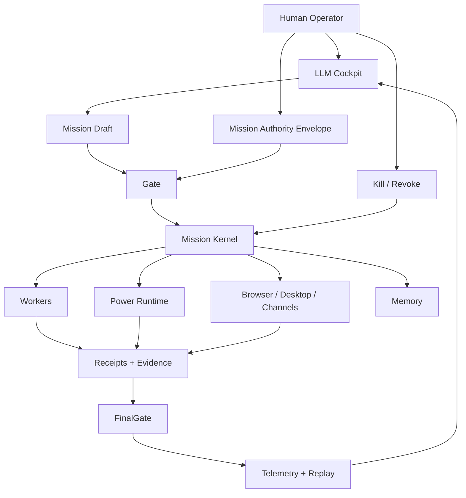

<div align="center">

# SENTINEL CONTROL

### A cognitive operating system for AI that can act — without outranking its operator.

**Model = intelligence. Sentinel = body, authority, memory, evidence, and runtime.**


[Why Sentinel](#why-sentinel) · [Architecture](#architecture) · [Capabilities](#capabilities) · [Run it](#quick-start) · [Engineering truth](#engineering-truth) · [Roadmap](#roadmap)

</div>

---

## Why Sentinel

Giving an AI more tools is easy.

Giving an AI **browser access, code execution, memory, workers, credentials, desktop reach, channels, and long-running missions** while keeping human authority stronger than the agent is a much harder systems problem.

Sentinel is an experimental answer to that problem.

It treats the model as the **mind**, not the operating system. The model can reason, plan, interpret, and propose. Sentinel owns the parts that must remain deterministic and governable: authority, execution, state, evidence, replay, revocation, and terminal truth.

```text
MODEL
  reasons · plans · interprets · adapts

SENTINEL
  senses · executes · remembers · constrains · proves

HUMAN OPERATOR
  grants authority · changes authority · revokes authority · kills the mission
```

The goal is not a weaker agent.

The goal is **maximum useful power inside explicit, inspectable boundaries**.

---

## The core idea

Most agent stacks look roughly like this:

```text
LLM -> tools -> result
```

Sentinel inserts an operating system between intelligence and power:

```text
intent
  ↓
model reasoning
  ↓
mission + authority envelope
  ↓
Gate
  ↓
Mission Kernel
  ↓
controlled organs / skills / workers
  ↓
receipts + evidence
  ↓
FinalGate
  ↓
telemetry + replay + durable memory
```

A model response is **never authority**. Memory is **never authority**. A receipt is **proof of an event, not permission for the next one**.

---

## Architecture



### Design laws

- **Authority before action**
- **Proof before trust**
- **Receipts before claims**
- **Replay before certification**
- **Memory as context, never permission**
- **Workers as bounded children, never root agents**
- **Voice, browser, desktop, and channels as surfaces, never authority sources**
- **Human revocation remains stronger than the runtime**

---

## Capabilities

Sentinel is not one agent loop. It is a collection of governed runtime systems that converge into one mission spine.

| System | What exists today |
|---|---|
| **Mission Kernel** | Durable mission state, queueing, checkpoints, resume, replay, dead-letter and terminal records |
| **Authority Kernel** | Explicit authority envelopes, gates, revocation checks, bounded execution contracts |
| **Browser Organ / Browser Cortex** | Cloak/session-led browser runtime, structured environment state, search/extraction/recovery paths, evidence and replay |
| **Code & Workspace** | Controlled code/workspace actions through the product action spine |
| **Workers** | Governed child workers with bounded scopes, budgets, deadlines and merge/reject contracts |
| **Memory** | Persistent semantic context designed so memory cannot silently grant power |
| **Telemetry** | Local evidence, runtime metrics, authority events, model/tool traces and replay-oriented records |
| **Desktop** | Permissioned observation, visual grounding, action proposals and injected/fake action backends |
| **Voice** | Realtime voice runtime foundation with barge-in, command envelopes and kill-word handling |
| **Channels** | Draft/send architecture with explicit outbound authority and replay-safe semantics |
| **Credential Vault** | Durable secret metadata, scoped leases/handles, unlock sessions and receipt-bound use |
| **Account Authority** | Governed login/account planning with explicit human checkpoints and no MFA/CAPTCHA bypass |
| **Financial Authority** | Sandbox spend and paper-trading authority models with caps, velocity controls and idempotency |
| **Model Router** | Explicit model contracts and route simulation without hidden provider fallback |
| **Skill Fabric** | Versioned procedures with provenance, scanning, quarantine, approval, revocation and rollback posture |

### What Sentinel deliberately does **not** claim yet

Sentinel is experimental. It does **not** currently claim universal public-site automation, production live-money execution, a production OS credential backend, a production desktop service/tray application, or general browser intelligence.

The project keeps failed gates and incomplete proofs visible instead of converting them into marketing claims.

---

## Engineering truth

Sentinel uses lock reports, frozen evaluation lanes, receipts, and explicit failure states to distinguish **implemented code** from **proven product behavior**.

The canonical current state is maintained here:

- [`CURRENT_STATE_LOCK.md`](sentinel-control/docs/CURRENT_STATE_LOCK.md)
- [`SENTINEL_MASTER_ROADMAP_TO_COMPLETION.md`](sentinel-control/docs/roadmaps/SENTINEL_MASTER_ROADMAP_TO_COMPLETION.md)
- [`deep_power_audit/`](sentinel-control/docs/reviews/deep_power_audit/)

### Current browser lane

As of the latest canonical state recorded **2026-07-22**:

```text
current phase:
SENTINEL_BROWSER_PROOF_V2_LOCAL_DEFECT_FIX_AND_TRUTH_UPDATE_V1

local repair candidate:
VALID_LOCAL_FIX_CANDIDATE

latest live V2 truth:
material browser receipts missing = 4
technical completion             = 0/6
useful answer completion          = 0/6

next proof:
BROWSER_RECEIPT_PERSISTENCE_AND_ANSWER_CLAIM_EVIDENCE_REAL_NON_HOLDOUT_PROOF_V3
```

That failed live gate is intentional public evidence: Sentinel does not call a browser capability “done” because a demo looked good.

The latest documented local browser-repair validation records **201 targeted tests passing**, plus `compileall` and `git diff --check`, before the next live V3 proof run.

---

## Quick start

### Requirements

- Python **3.11+**
- Git
- Optional: Cloak Browser support for the browser runtime

### Install the core

```bash
git clone https://github.com/Gameminde/SENTINAL.git
cd SENTINAL/sentinel-control/services/sentinel-core

python -m venv .venv
```

Activate the environment:

```bash
# macOS / Linux
source .venv/bin/activate

# Windows PowerShell
.venv\Scripts\Activate.ps1
```

Install Sentinel Core with test and Cloak extras:

```bash
python -m pip install --upgrade pip
pip install -e ".[test,cloak]"
```

### Run the deterministic cockpit

```bash
python -m sentinel cockpit --deterministic-test-mode
```

Product LLM mode requires an explicit model contract. Sentinel intentionally has no approved hidden provider fallback:

```bash
python -m sentinel cockpit --model-contract <config>
```

### Run tests

```bash
pytest
```

---

## Repository map

```text
SENTINAL/
├── sentinel-control/
│   ├── apps/                  # product surfaces
│   ├── docs/                  # architecture, roadmaps, reviews, lock reports
│   ├── examples/
│   ├── packages/
│   ├── services/
│   │   └── sentinel-core/
│   │       ├── sentinel/
│   │       │   ├── agent/
│   │       │   ├── memory/
│   │       │   ├── operator/
│   │       │   ├── power/
│   │       │   └── telemetry/
│   │       └── tests/
│   └── supabase/
│
└── agent-lab/                 # research-only mechanism study
```

`agent-lab/` is intentionally separated from the product runtime. It is used to study external mechanisms without silently importing vendor runtime behavior into Sentinel.

---

## A mission, end to end

The product experience is meant to stay simple even when the machinery underneath is not.

```text
User: Sentinel, I want to launch a business around AI training.

Sentinel:
  understand the objective
  clarify constraints
  establish authority
  create a durable mission
  research through governed browser power
  delegate bounded work
  produce artifacts
  record evidence
  stop for authority when required
  certify completion only when the evidence supports it
```

Under the surface:

```text
conversation
-> MissionDraft
-> MissionAuthorityEnvelope
-> Gate
-> MissionKernel
-> workflow / workers
-> PowerRuntime / controlled organs
-> receipts
-> FinalGate
-> telemetry
-> replay
-> memory feedback
```

---

## Roadmap

The current priority is **real-world power convergence**: turning already-built subsystems into reliable end-to-end missions instead of adding endless new actuator families.

Near-term focus:

1. Close the current browser proof/receipt defects.
2. Re-run versioned real-model browser proof without changing the frozen target after seeing results.
3. Improve long-horizon recovery and useful task completion.
4. Converge browser, code/workspace, workers, memory and evidence on the same production mission spine.
5. Expand real channel, desktop and credential backends only behind the existing authority model.
6. Run cross-domain mission gauntlets with evidence strong enough for independent review.

For the full build order, see the [master roadmap](sentinel-control/docs/roadmaps/SENTINEL_MASTER_ROADMAP_TO_COMPLETION.md).

---

## What makes Sentinel different?

Sentinel is not trying to make an LLM sovereign over its tools.

It is trying to build the missing layer between **intelligence** and **real-world power**.

```text
The model may become smarter.
The tools may become stronger.
The mission may become longer.

Authority must still remain explicit.
Evidence must still survive the run.
Replay must still tell the truth.
And the human must still be able to say: stop.
```

<div align="center">

### Powerful AI should be able to act.
### It should also be able to prove what it did.

**Sentinel Control**

<sub>The GitHub repository is named <code>SENTINAL</code>; the product and codebase are <strong>Sentinel Control</strong>.</sub>

</div>
