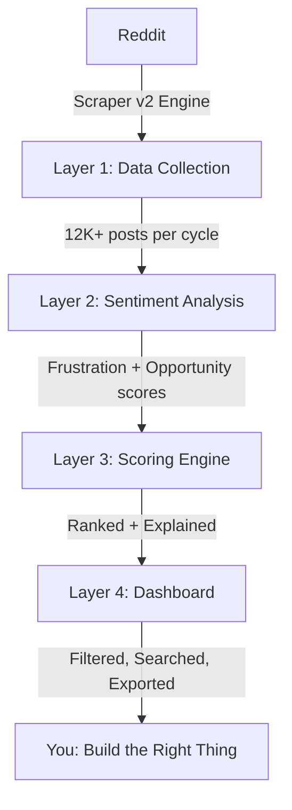

# RedditPulse — Product Blueprint

## What It Is (One Sentence)

RedditPulse is a **business intelligence tool** that scans Reddit 24/7 to find people desperately asking for products that don't exist — scored, ranked, and served to you on a live dashboard so you know exactly what to build next.

---

## The Problem

Every day, thousands of real people post on Reddit:
- *"I wish there was a tool that..."*
- *"I'd pay for something that..."*
- *"I'm so frustrated with X, is there an alternative?"*

These are **pre-validated business ideas** hidden in plain sight. But:
1. Nobody has time to read 10,000+ posts across 15 subreddits
2. Even if you read them, you can't score which ones are worth pursuing
3. You can't track trends — is this pain growing or dying?
4. You can't tell if someone's venting or genuinely willing to pay

**RedditPulse solves all four.**

---

## How It Works — The 4-Layer Engine



### Layer 1 — Scraper (Hardened)

| Feature | Detail |
|---------|--------|
| **Sources** | 15 business subreddits (r/SaaS, r/Entrepreneur, r/smallbusiness, r/shopify, etc.) |
| **Method** | Reddit JSON endpoints + OAuth API fallback |
| **Anti-blocking** | Dual-domain rotation, smart 429 handling, per-domain health tracking |
| **Rate limiting** | 2s delay + random jitter, exponential backoff, auto-pause blocked domains |
| **Quality gates** | Spam filter (affiliate/self-promo), humor filter (memes/jokes), min 20 chars, removed/deleted skip |
| **Frequency** | Every 30 minutes via GitHub Actions (Azure IPs — not blocked by Reddit) |
| **Output per cycle** | ~800-1,200 new posts per cycle |

> **Why it won't break:** If `www.reddit.com` blocks us → rotates to `old.reddit.com`. If both block → falls back to Reddit OAuth API (60 req/min authenticated). If ALL fail → health check reports status, skips cycle, retries next window.

### Layer 2 — Sentiment Analyzer

| Component | What It Does |
|-----------|-------------|
| **VADER Sentiment** | Scores text -1 to +1 (positive/negative), extended with 19 Reddit-specific words |
| **Frustration Detection** | 25 regex patterns: emotional pain, time waste, tool complaints, pricing rage, integration gaps |
| **Opportunity Detection** | 15 regex patterns: tool seeking, WTP signals, feature requests, comparison shopping |
| **Context Validation** | Filters out non-business frustration (personal, gaming, homework) |
| **Industry Classification** | Auto-tags each post into 10 industries using keyword matching |

**Reddit-tuned words we added to VADER:**
| Word | Sentiment Score | Why |
|------|:-:|-----|
| enshittification | -3.0 | Product degradation = huge opportunity |
| paywalled | -2.5 | Pricing frustration = undercut them |
| scope creep | -2.5 | Freelancer pain = tool opportunity |
| copium | -1.0 | Coping = real frustration underneath |
| game changer | +2.0 | Validates that solutions exist |
| lifesaver | +2.5 | Extreme positive = what your tool should feel like |

### Layer 3 — Scoring Engine

**Formula:**
```
Final Score = (Engagement × 0.30 + Frustration × 0.30 + Phrase Match × 0.25 + 
              Recency × 0.10 + Cross-Sub × 0.05) × 100 × Opportunity Bonus × Confidence
```

| Factor | Weight | How It's Calculated |
|--------|:------:|------------|
| Engagement | 30% | Log-normalized against **per-subreddit baselines** (50 upvotes in r/shopify ≠ 50 in r/webdev) |
| Frustration | 30% | Frustration marker hits / 8, capped at 1.0 |
| Phrase Match | 25% | Number of pain phrases matched / 5 |
| Recency | 10% | Full bonus < 7 days, decays to 0 over 90 days |
| Cross-Subreddit | 5% | Same pain in 3+ subreddits → universal problem |
| **Opportunity Bonus** | ×1.0-1.3 | WTP signals boost score up to 30% |
| **Confidence** | ×0.7-1.0 | Short text / low engagement → score penalized |

**Every score comes with an explanation:**
> *"Score 87: High engagement for r/SaaS, Strong frustration (4 signals), Pain phrases: 'wish there was', 'tired of manually', Universal pain (5 subreddits)"*

### Layer 4 — Dashboard

| Tab | What User Sees | Plan Required |
|-----|---------------|:---:|
| 🎯 Opportunities | Ranked post feed with scores, filters, search, pain phrase tags | All |
| 📊 Subreddits | Breakdown by sub with post count, avg score, desperation density | All |
| 🏢 Competitors | 30+ tools tracked with mention count + negative sentiment bars | Pro+ |
| 💰 Willing to Pay | Posts where people mention budgets, pricing, "I'd pay for" | Pro+ |
| 📥 CSV Export | Download filtered data for spreadsheets / custom analysis | Starter+ |

---

## User Journey

### 1. Discovery → Landing Page
User sees: *"Turn Reddit Pain Into Business Gold"* + live stats (12,359 posts scanned, 1,927 opportunities) + 3-tier lifetime pricing.

### 2. Sign Up → Pick Subreddits
User creates account (email or Google) → selects 5-25 subreddits relevant to their niche → system starts scanning.

### 3. First Data (within 30 minutes)
GitHub Actions scraper runs → posts flow into Supabase → dashboard populates. User sees their first scored opportunities.

### 4. Daily Use
- Check dashboard for new high-scoring posts
- Filter by subreddit, desperation level, or search terms
- Click through to original Reddit thread to validate
- Export interesting finds to CSV for deeper research
- Check competitor tab to see which tools people are leaving

### 5. Take Action
User finds a cluster of posts asking for the same thing → validates the idea is real → builds the product → goes back to those Reddit threads to announce it.

---

## What Makes This Worth $99

| What Alternatives Cost | What RedditPulse Costs |
|--|--|
| Hire a market researcher: **$2,000-10,000** | **$99 once** |
| Manual Reddit browsing: **40+ hours** | **Automated, 24/7** |
| Survey tools (Typeform + ads): **$500+/month** | **$0/month after purchase** |
| Competitor analysis tools: **$100-300/month** | **Included** |
| Trend monitoring (Brandwatch, Mention): **$99-500/month** | **Included** |

The tool pays for itself the moment it helps you find ONE validated business idea.

---

## Competitive Landscape

| Tool | What It Does | Price | Gap RedditPulse Fills |
|------|-------------|:--------:|-----|
| GummySearch | Reddit audience research | $48/mo | Subscription, no scoring engine, no WTP detection |
| SparkToro | Audience intelligence | $50/mo | Not Reddit-specific, no pain-point scoring |
| Google Trends | Search volume trends | Free | Shows WHAT's trending, not WHO needs help |
| Exploding Topics | Trend detection | $97/mo | Shows trends, not pain points or tool requests |
| Manual Reddit browsing | Reading posts one by one | Free | Takes 40+ hours, no scoring, no patterns |

**Our edge:** One-time payment (no recurring), pain-point-specific (not general audience data), willingness-to-pay detection (none of them do this), and competitor sentiment tracking.

---

## Technical Architecture

```
┌─────────────────────────────────────────────────────────────────┐
│                        GitHub Actions                           │
│        (Runs every 30min on Azure IPs — free tier)              │
│  ┌──────────────────────────────────────────────────────────┐   │
│  │  engine/scraper.py → analyzer.py → scorer.py             │   │
│  │  OAuth fallback │ VADER+Reddit │ Per-sub normalized      │   │
│  │  Domain rotation│ 25 frust.    │ Cross-sub boost         │   │
│  │  Spam filter    │ 15 opp.      │ Confidence score        │   │
│  └──────────────────────┬───────────────────────────────────┘   │
└─────────────────────────┼───────────────────────────────────────┘
                          │ Writes scored posts
                          ▼
┌─────────────────────────────────────────────────────────────────┐
│                     Supabase (PostgreSQL)                        │
│  Tables: posts, profiles, projects, scrape_runs                 │
│  RLS: users see only their own data                             │
│  Auto-profile creation on signup                                │
└─────────────────────────┬───────────────────────────────────────┘
                          │ Reads via Supabase client
                          ▼
┌─────────────────────────────────────────────────────────────────┐
│                     Next.js App (Vercel)                         │
│  Landing page │ Auth (email+Google) │ Dashboard                 │
│  Middleware   │ Stripe LTD payment  │ CSV export                │
│  Score breakdown │ Competitor tab   │ WTP alerts                │
└─────────────────────────────────────────────────────────────────┘
```

---

## Data Quality Guarantees

| Guarantee | How We Enforce It |
|-----------|------------------|
| No spam posts | Regex filter removes affiliate/self-promo before storage |
| No joke/meme posts | Dual-pattern humor filter (needs 2+ humor indicators) |
| Accurate sentiment | VADER + Reddit-specific lexicon (19 words) + 25 frustration patterns |
| Fair scoring | Per-subreddit normalization (r/shopify baseline ≠ r/marketing) |
| Score transparency | Every post shows WHY it scored high (breakdown + explanation) |
| Fresh data | Health check before every cycle, staleness warnings if > 24h gap |
| No duplicates | Dedup by Reddit post ID before storage |
| Business-relevant only | Context validation filter removes personal/gaming/homework rants |
