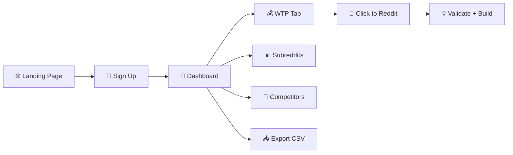

# RedditPulse — Complete User Flow

## The Journey: From Stranger → Paying Customer → Daily User



---

## Stage 1: Landing Page (stranger arrives)

**URL:** `redditpulse.com`

**What they see:**
1. Hero: *"Turn Reddit Pain Into Business Gold"*
2. Live stats: 12,359 posts scanned, 1,927 opportunities, 350 WTP signals
3. 6 feature cards (Pain Scanner, Scoring, Competitors, Alerts, WTP, Clusters)
4. 3-tier pricing: $49 / $99 / $199 (lifetime)
5. "Start Scanning" CTA → goes to `/login`

**What they think:** *"People are literally telling me what to build? For $99 once?"*

**What happens behind the scenes:** Nothing — the landing page is static, loads fast.

---

## Stage 2: Sign Up

**URL:** `redditpulse.com/login`

**What they see:**
- "Continue with Google" button (one-click)
- OR email + password fields
- Toggle: "No account? Sign up"

**What they do:** Click Google → authorize → redirect to `/dashboard`

**What happens behind the scenes:**
1. Supabase Auth creates user
2. Trigger auto-creates `profiles` row (plan = "free")
3. Middleware detects session → allows `/dashboard` access

---

## Stage 3: First Dashboard Load

**URL:** `redditpulse.com/dashboard`

**What they see:**
```
┌──────────────────────────────────────────────┐
│ 📡 RedditPulse    user@email.com  [FREE]     │
├──────────────────────────────────────────────┤
│ 📝 Total Posts │ 🎯 Opportunities │ 📊 Subs │ 🔥 High Desp │
│   12,359       │     247          │   15    │    892       │
├──────────────────────────────────────────────┤
│ [🎯 Opportunities] [💰 Willing to Pay] [📊 Subreddits] [🏢 Competitors 🔒] │
├──────────────────────────────────────────────┤
│ Search... │ All Subreddits ▼ │ All Levels ▼ │ 📥 Export CSV │
├──────────────────────────────────────────────┤
│ 87 │ "I wish there was a tool that..." │ r/SaaS │ extreme │
│ 82 │ "Anyone know a better alternative..." │ r/shopify │ high │
│ ...200 rows...                                               │
└──────────────────────────────────────────────┘
```

**What they do:** Browse top opportunities, see scores, click pain phrase tags.

**What happens behind the scenes:**
- Server fetches top 200 posts from Supabase ordered by `opportunity_final_score`
- Client-side: competitor analysis computed, WTP detection runs, filters initialize

---

## Stage 4: Exploring Opportunities

**User actions:**
1. **Search** — types "invoice" → sees all posts mentioning invoicing problems
2. **Filter by subreddit** — picks "r/freelance" → sees freelancer-specific pain
3. **Filter by desperation** — picks "Extreme" → sees only people who are DESPERATE
4. **Read a post** — sees score badge (87), desperation badge (extreme), pain phrase tags ("I wish there was", "waste so much time")
5. **Click "View →"** — opens original Reddit thread in new tab to validate

**What they think:** *"Holy shit, 12 people are asking for an invoicing tool for freelancers and nobody's built one."*

---

## Stage 5: WTP Detection (the hero feature)

**User clicks "💰 Willing to Pay" tab**

**What they see:**
```
┌──────────────────────────────────────────────┐
│ WTP Posts Found    │ Avg Score      │ Top Sub │
│     47             │    71          │ r/SaaS  │
├──────────────────────────────────────────────┤
│ People saying they would PAY for a solution:  │
│ 91 │ "Would pay $50/mo for a Zapier..." │ r/SaaS     │
│ 85 │ "Happy to pay for a simpler..."    │ r/shopify  │
│ 79 │ "Budget is around $200 for..."     │ r/freelance│
└──────────────────────────────────────────────┘
```

**Why this matters:** These aren't just complaints — these are people with **credit cards ready**. Each row is a pre-validated customer for whatever you build.

---

## Stage 6: Competitor Tracking (Pro only)

**User clicks "🏢 Competitors" tab**

**Free users see:** Locked message → "Upgrade to Pro — $99 Lifetime"

**Pro users see:**
```
┌───────────────────────────────────────────────┐
│ Tool        │ Mentions │ Complaints │ Neg % │ ██████░░ │
│ QuickBooks  │ 34       │ 12         │ 35%   │ ████░░░░ │
│ Zapier      │ 28       │ 8          │ 29%   │ █████░░░ │
│ Mailchimp   │ 22       │ 15         │ 68%   │ ██░░░░░░ │
└───────────────────────────────────────────────┘
```

**What they think:** *"68% of Mailchimp mentions are negative? I could build a better email tool and steal their users."*

---

## Stage 7: Export & Take Action

**User clicks "📥 Export CSV"**

Downloads a file: `redditpulse_export_2026-03-04.csv`

Contains: Score, Title, Subreddit, Desperation, Upvotes, Comments, URL

**What they do next:**
1. Open in Google Sheets
2. Group by pain theme
3. Estimate market size
4. Pick their favorite validated idea
5. Start building

---

## Flow Gaps We Need to Build

| Gap | What's Missing | Priority |
|-----|---------------|:---:|
| **Subreddit Picker** | After signup, user can't choose WHICH subreddits to track — they see global data | 🔴 |
| **Score Breakdown** | User sees score "87" but can't click to see WHY (engagement 85, frustration 70, etc.) — we compute it but don't show it yet | 🟠 |
| **Onboarding Wizard** | New user lands on dashboard with no guidance — needs a 3-step intro | 🟡 |
| **Data Freshness** | No indicator showing when data was last scraped — user doesn't know if it's hours or days old | 🟡 |

---

## The Money Moment

The exact moment a user decides RedditPulse is worth $99:

> They filter to their niche (e.g., "r/freelance") → see 5 posts with scores 75+ all asking for the same missing tool → click the WTP tab → find 3 people who said "I'd pay for this" → realize nobody has built it yet → **this is their business idea.**

Everything in the product leads to that moment. Every feature, every filter, every score — it all funnels toward: *"Here's what to build, here's proof people will pay."*
