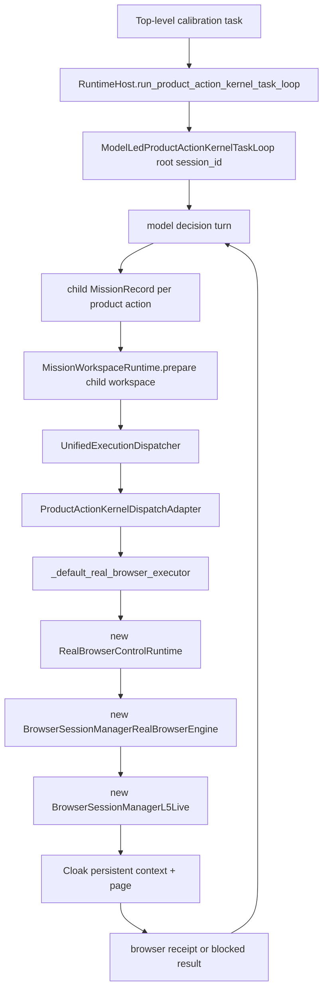

# SENTINEL_REAL_BROWSER_BODY_SESSION_LIFECYCLE_AND_ACTUATION_STABILITY_V1_STAGE0_REVIEW

## Verdict

```text
REAL_BROWSER_BODY_SESSION_LIFECYCLE_AND_ACTUATION_STABILITY_V1_STAGE0
= VALID_REVIEW_AND_BODY_REPRODUCTION

runtime_behavior_modified = no
provider_calls = 0
real_provider_used = no
frozen_holdout_used = no
playwright_fallback = no
implementation_started = no
```

Stage 0 reviewed only the real browser body/session lifecycle path requested by
the operator:

```text
RuntimeHost
ModelLedProductActionKernelTaskLoop
MissionWorkspaceRuntime
ProductActionKernel browser dispatch
RealBrowserControlRuntime
BrowserSessionManagerL5Live
CloakBrowserSessionBackend
profile/process/context/page ownership
readiness probe
cleanup/revocation/replay
```

The leading root-cause hypothesis was reproduced through body-only execution:

```text
sequential close/open = passed
overlapping unclosed Cloak persistent contexts = reproduced failure
failure = cloakbrowser_open_failed:Error
product-loop body-only second search = real_browser_search_session_open_failed
```

This is enough to proceed to implementation in the next tranche, but this
report intentionally does not implement the fix.

## Calibration Evidence Used

The accepted calibration report recorded:

```text
tasks_total = 12
provider_decision_calls = 46
model_native_intent_accepted_count = 46
top_level_task_outcomes = 12 exception_preserved
top_level_exception_class = FileNotFoundError
missions_created_in_ledger = 45
dispatch_completed = 3
dispatch_blocked = 41
browser/product receipts in ledger = 46
real_browser_search_session_open_failed = 40
real_browser_search_control_not_found = 1
one partially operational task = search -> extract -> verify -> summarize evidence
```

Interpretation preserved from calibration:

```text
provider/model path alive = true
model-native browser intent alive = true
Cloak readiness gate passed before provider use = true
real browser body/session path reliable = false
```

## 1. Exact Resource Ownership Table

| Resource | Current owner | Creator | Closer/remover | Stage 0 finding |
|---|---|---|---|---|
| Root product loop | `ModelLedProductActionKernelTaskLoop` | `RuntimeHost.run_product_action_kernel_task_loop()` in `sentinel/operator/runtime_host.py:351` | loop returns result; no browser teardown owner | Owns mission sequence but not a root browser session lease. |
| Child product mission | `ModelLedProductActionKernelTaskLoop._dispatch_product_action()` | creates `MissionRecord` in `sentinel/operator/model_led_product_action_kernel_task_loop.py:502` | mission status closeout only | Every action becomes a child mission; browser session continuity is not root-scoped. |
| Mission workspace body | `MissionWorkspaceRuntime` | `prepare()` creates `mission_workspace` and handles in `sentinel/operator/mission_workspace_runtime.py:152` | no live browser process ownership | Browser session handle is a safe data handle, not an executable session lease. |
| Product browser dispatch | `ProductActionKernelDispatchAdapter` | route registered in `sentinel/operator/runtime_host.py:156` | writes receipts/finalgate only | Dispatch owns proof, not browser process cleanup. |
| Browser skill runtime | `RealBrowserControlRuntime` | `_default_real_browser_executor()` creates a new runtime per dispatch in `sentinel/operator/runtime_host.py:529` | `RealBrowserControlRuntime.close()` exists but is not called by `_default_real_browser_executor()` | Strong leak candidate. |
| Browser engine adapter | `BrowserSessionManagerRealBrowserEngine` | `_product_browser_engine()` returns `build_cloak_first_real_browser_engine_from_env()` in `sentinel/operator/runtime_host.py:612` | `close()` calls manager `close_all()` and profile cleanup in `sentinel/operator/real_browser_control_runtime.py:427` | Engine is created per action when live browser env is set. |
| L5 session manager | `BrowserSessionManagerL5Live` | `_build_browser_session_manager()` in `sentinel/operator/real_browser_control_runtime.py:2333` | `close_all()` in `sentinel/agent/organs/browser_session_manager_l5_live.py:1005` | Close exists but product path does not guarantee it is called after each action or at loop shutdown. |
| Live browser session | `_LiveBrowserSession` | `open_session()` stores in `_sessions` in `sentinel/agent/organs/browser_session_manager_l5_live.py:407` | `_LiveBrowserSession.close()` in `sentinel/agent/organs/browser_session_manager_l5_live.py:333` | Session lifetime is manager-local; new managers cannot see old sessions. |
| Cloak persistent context | `CloakBrowserSessionBackend` / `BrowserEngineSession` | `launch_persistent_context()` in `sentinel/organs/browser/cloak_backend.py:92` | `BrowserEngineSession.close()` in `sentinel/organs/browser/cloak_backend.py:23` | Overlap without closing reproduces the live failure class. |
| Browser page | `BrowserEngineSession.page` | `context.new_page()` in `sentinel/organs/browser/cloak_backend.py:102` | context close should close page | No root-scoped page reuse across product child actions. |
| Profile directory | `BrowserSessionManagerL5Live._session_dir()` plus backend `profile_dir.mkdir()` | `_session_dir()` in `sentinel/agent/organs/browser_session_manager_l5_live.py:1190`, backend mkdir in `sentinel/organs/browser/cloak_backend.py:90` | `_remove_profile_material()` in `sentinel/operator/real_browser_control_runtime.py:2420` | Cleanup is available but tied to explicit close/probe paths, not product dispatch lifecycle. |

## 2. Root Task Versus Child Mission Lifecycle Graph



Lifecycle mismatch:

```text
root task = multi-turn mission continuity
child mission = one product action
current live browser engine/session = created inside one child action
current cleanup = only explicit close/probe path
result = the root loop asks for continuity, but the browser body is child-action scoped
```

## 3. Profile Directory Creators And Removers

Creators:

| Code | Evidence |
|---|---|
| `MissionRunStore.__init__` creates run root | `sentinel/operator/store.py:35-37` |
| `MissionWorkspaceRuntime.prepare` creates child mission workspace | `sentinel/operator/mission_workspace_runtime.py:152-154` |
| `BrowserSessionManagerL5Live.__init__` creates `capture_root` | `sentinel/agent/organs/browser_session_manager_l5_live.py:375-376` |
| `BrowserSessionManagerL5Live._session_dir` creates `capture_root/bs/<hash>` | `sentinel/agent/organs/browser_session_manager_l5_live.py:1190-1193` |
| `CloakBrowserSessionBackend.open_context` creates `profile_dir` | `sentinel/organs/browser/cloak_backend.py:90` |

Removers/cleanup:

| Code | Evidence |
|---|---|
| `BrowserSessionManagerRealBrowserEngine.close` calls manager `close_all()` and `_remove_profile_material()` | `sentinel/operator/real_browser_control_runtime.py:427-434` |
| `BrowserSessionManagerL5Live.close_all` sanitizes and closes all registered sessions | `sentinel/agent/organs/browser_session_manager_l5_live.py:1005-1013` |
| `BrowserSessionManagerL5Live.close_session` sanitizes, closes and removes one session | `sentinel/agent/organs/browser_session_manager_l5_live.py:530-543` |
| `_LiveBrowserSession.close` calls `engine_session.close()` | `sentinel/agent/organs/browser_session_manager_l5_live.py:333-338` |
| `BrowserEngineSession.close` closes context and optional owner | `sentinel/organs/browser/cloak_backend.py:23-33` |
| `_probe_cloak_readiness` closes manager and removes profile material in `finally` | `sentinel/operator/real_browser_control_runtime.py:2322-2329` |
| `_remove_profile_material` removes profile-sensitive paths and ignores missing files | `sentinel/operator/real_browser_control_runtime.py:2420-2434` |

Important gap:

```text
_default_real_browser_executor creates RealBrowserControlRuntime but does not call runtime.close().
ProductActionKernelDispatchAdapter does not know how to close skill runtime resources.
RuntimeHost.shutdown stops daemon only; it does not close live browser engines.
```

## 4. Session / Process / Context / Page Creators And Closers

Creators:

| Resource | Creator | Evidence |
|---|---|---|
| `RealBrowserControlRuntime` | `_default_real_browser_executor` | `sentinel/operator/runtime_host.py:529-537` |
| `BrowserSessionManagerRealBrowserEngine` | `build_cloak_first_real_browser_engine_from_env` | `sentinel/operator/real_browser_control_runtime.py:1882-1897` |
| `BrowserSessionManagerL5Live` | `_build_browser_session_manager` | `sentinel/operator/real_browser_control_runtime.py:2333-2341` |
| L5 live session | `BrowserSessionManagerL5Live.open_session` | `sentinel/agent/organs/browser_session_manager_l5_live.py:385-408` |
| Cloak persistent context / process owner | `CloakBrowserSessionBackend.open_context` | `sentinel/organs/browser/cloak_backend.py:74-119` |
| Page | `context.new_page()` | `sentinel/organs/browser/cloak_backend.py:102` |

Closers:

| Resource | Closer | Evidence |
|---|---|---|
| Runtime engine session manager | `BrowserSessionManagerRealBrowserEngine.close` | `sentinel/operator/real_browser_control_runtime.py:427-434` |
| All L5 live sessions | `BrowserSessionManagerL5Live.close_all` | `sentinel/agent/organs/browser_session_manager_l5_live.py:1005-1013` |
| One L5 live session | `BrowserSessionManagerL5Live.close_session` | `sentinel/agent/organs/browser_session_manager_l5_live.py:530-543` |
| Context/process owner | `BrowserEngineSession.close` | `sentinel/organs/browser/cloak_backend.py:23-33` |
| Readiness engine | `_probe_cloak_readiness finally` | `sentinel/operator/real_browser_control_runtime.py:2322-2329` |

Observed design smell:

```text
Creator is in the product dispatch executor.
Closer is on the runtime/engine object.
No product-loop finally block owns that object.
```

## 5. FileNotFoundError Boundaries

Calibration preserved a top-level `FileNotFoundError`. Stage 0 did not yet
reproduce that exact top-level exception, but identified the relevant boundaries:

| Boundary | Code evidence | Stage 0 assessment |
|---|---|---|
| Mission record load | `MissionRunStore.load_record()` uses direct `Path.read_text()` in `sentinel/operator/store.py:54-56` | Can raise `FileNotFoundError` if a mission record path is referenced after missing/failed creation. |
| Atomic artifact write | `MissionRunStore.atomic_write_json()` uses `NamedTemporaryFile(..., dir=path.parent)` and `os.replace()` in `sentinel/operator/store.py:234-253` | Parent is created first; less likely unless parent disappears concurrently. |
| Mission directory creation | `MissionRunStore._mission_dir(create=True)` uses `mkdir()` in `sentinel/operator/store.py:255-263` | Guarded by create flag. |
| Cloak open wrapping | `CloakBrowserSessionBackend.open_context()` catches `Exception` and raises `BrowserSessionEngineError("cloakbrowser_open_failed:<class>")` in `sentinel/organs/browser/cloak_backend.py:118-119` | Underlying `FileNotFoundError` can be hidden as `cloakbrowser_open_failed:FileNotFoundError` or `Error` depending on wrapper. |
| Profile cleanup | `_remove_profile_material()` ignores `FileNotFoundError` during unlink in `sentinel/operator/real_browser_control_runtime.py:2429-2432` | Cleanup missing-file races are intentionally swallowed, not top-level. |
| JSON proof verification | Product proof loaders check artifact existence before load in `sentinel/operator/unified_execution_dispatcher.py:991-994` and `1029-1031` | More likely to produce proof failure codes than raw `FileNotFoundError`. |

Open truth:

```text
The exact calibration top-level FileNotFoundError remains unproven in Stage 0.
The body/session failure class was reproduced, and it plausibly caused most
mission-level blocked results before the top-level harness exception surfaced.
```

## 6. Readiness Claims Versus Operational Checks

Readiness currently proves:

```text
SENTINEL_BROWSER_TEST_URL exists
selected_backend_id = cloak_browser
actual_backend_id = cloak_browser
session_backend_kind = cloakbrowser
engine.open() returns one snapshot
readiness receipt hash exists
close_all and profile cleanup run in readiness finally
profile_material_persisted = false
```

Code evidence:

```text
check_cloak_session_readiness_from_env = sentinel/operator/real_browser_control_runtime.py:1903
check_cloak_session_readiness = sentinel/operator/real_browser_control_runtime.py:1927
_probe_cloak_readiness = sentinel/operator/real_browser_control_runtime.py:2278
engine.open() only = sentinel/operator/real_browser_control_runtime.py:2291
readiness cleanup finally = sentinel/operator/real_browser_control_runtime.py:2322-2329
```

Readiness does not prove:

```text
product route can execute two browser actions in one root task
root task owns a single reusable browser session lease
child mission browser handles map to the same live session
unclosed first action cannot poison second action
search action can recover without opening a second persistent context
body failure circuit breaker prevents repeated provider calls
```

Conclusion:

```text
Current readiness is a one-shot bootstrap probe, not an operational product-loop
lifecycle probe.
```

## 7. Cleanup Race And Stale-Handle Candidates

Ranked candidates:

1. **Unclosed runtime after dispatch**:
   `_default_real_browser_executor()` creates `RealBrowserControlRuntime` and
   immediately returns `runtime.execute(...)` with no `finally: runtime.close()`.

2. **Per-action engine/session managers**:
   `_product_browser_engine()` builds a fresh Cloak engine for each action when
   `SENTINEL_BROWSER_TEST_URL` is present. Each engine owns a new L5 manager.

3. **Root task has data handle, not live lease**:
   `MissionWorkspaceRuntime` creates a `browser_session` handle, but the handle
   is not connected to one root-owned live browser process/context.

4. **Readiness closes what product execution leaves open**:
   The readiness path calls close/cleanup in `finally`, while product execution
   relies on runtime object lifetime.

5. **Blocked open can still write blocked receipts without closing old sessions**:
   `BrowserSessionManagerL5Live._blocked()` sanitizes only the session resolved
   by request id. If open fails before a session id exists, no previous manager
   session can be closed from that new manager.

6. **Provider/model recall after body unavailable**:
   The loop treats recoverable action failures as another model turn when budget
   allows. In calibration this spent 46 provider decisions while the body kept
   returning the same session-open failure.

## 8. Ranked Root-Cause Hypotheses With Code And Runtime Evidence

### H1 - Reproduced: Unclosed overlapping Cloak persistent contexts poison later opens

Code evidence:

```text
_default_real_browser_executor creates runtime per action = runtime_host.py:529-537
runtime.close exists = real_browser_control_runtime.py:427-434
executor does not call runtime.close = runtime_host.py:529-537
Cloak open creates persistent context = cloak_backend.py:92
```

Body-only reproduction:

```text
sequential_close_open.status = passed
sequential_close_open.first.element_count = 60
sequential_close_open.second.element_count = 60
overlap_without_close.status = reproduced_failure
overlap_without_close.error_class = RealBrowserControlRuntimeError
overlap_without_close.reason = cloakbrowser_open_failed:Error
provider_calls = 0
playwright_fallback = false
```

Assessment:

```text
This is the leading actionable root cause.
```

### H2 - Reproduced on product path: Child-action browser lifetime does not match root-task mission continuity

Code evidence:

```text
root loop creates child mission per action = model_led_product_action_kernel_task_loop.py:480-556
child workspace prepared per action = model_led_product_action_kernel_task_loop.py:547
browser runtime created per dispatch = runtime_host.py:529
```

Body-only product-loop reproduction:

```text
status = blocked
blocked_reason = MODEL_CALL_BUDGET_EXHAUSTED
model_call_count = 2
capability_sequence =
  real_browser_control:real_browser.search
  real_browser_control:real_browser.search
first dispatch blocked_reason = real_browser_search_control_not_found
first dispatch safe_context_keys include browser_environment_state and browser_world_model
second dispatch blocked_reason = real_browser_search_session_open_failed
second dispatch safe_context_keys = []
provider_calls = 0
playwright_fallback = false
```

Assessment:

```text
The full product route reproduces the same class exposed by calibration.
```

### H3 - Supported: Readiness is too weak because it tests one clean open/close, not root-loop operation

Code evidence:

```text
readiness engine.open only = real_browser_control_runtime.py:2291
readiness finally closes/removes = real_browser_control_runtime.py:2322-2329
product route lacks equivalent lifecycle finally = runtime_host.py:529-537
```

Runtime evidence:

```text
readiness passed in calibration
calibration then produced 40 real_browser_search_session_open_failed
Stage 0 sequential close/open passed
Stage 0 overlapping open failed
```

Assessment:

```text
Readiness is necessary but not sufficient; it currently proves bootstrap, not
operational task-loop session lifecycle stability.
```

### H4 - Supported: Body failure consumes model/provider turns instead of triggering a body circuit breaker

Code evidence:

```text
_recover_action_failure appends recoverable observation and continues when budget allows
ProductActionKernelDispatchAdapter maps recoverable action_result to blocked dispatch result
```

Calibration evidence:

```text
46 provider decisions
40 real_browser_search_session_open_failed
```

Stage 0 body-only evidence:

```text
two deterministic model turns were consumed after body failures without provider calls
```

Assessment:

```text
After implementation, a body-level circuit breaker should prevent repeated
provider calls for unchanged session-open failure.
```

### H5 - Not primary: profile cleanup race removes needed material too early

Evidence against primary status:

```text
sequential close/open passed with profile cleanup
_remove_profile_material ignores missing cleanup files
```

Remaining risk:

```text
cleanup can still race with live contexts if close ownership remains ambiguous.
```

### H6 - Open: top-level FileNotFoundError source

Evidence:

```text
calibration top_level_exception_class = FileNotFoundError
Stage 0 body-only reproductions did not emit top-level FileNotFoundError
store.load_record can emit raw FileNotFoundError if record path is missing
cloak backend wraps most open failures before they leave the backend
```

Assessment:

```text
Investigate after fixing lifecycle ownership if the top-level exception remains.
Do not treat it as the leading blocker before the reproduced session-open issue.
```

## Implementation Guidance For Next Tranche

Do not patch search semantics first. The body must own session lifetime first.

Suggested root correction:

```text
1. Introduce a root-task browser session lease owned by RuntimeHost or
   ModelLedProductActionKernelTaskLoop, keyed by root session_id.

2. Reuse the same BrowserSessionManagerRealBrowserEngine / L5 manager across
   browser child actions inside one root task.

3. Add explicit close in a root-loop finally block and RuntimeHost shutdown path.

4. Make the product readiness gate execute an operational canary:
   open -> observe -> second action or second search intent -> close -> reopen.

5. Add a body circuit breaker:
   repeated unchanged real_browser_search_session_open_failed before material
   progress should block locally as BODY_SESSION_UNAVAILABLE, not spend more
   provider/model turns.

6. Preserve no Playwright fallback, no raw browser material persistence, and all
   hard boundaries.
```

## Stage 0 Validation Commands

Read-only review commands:

```text
rg -n "BrowserSessionManagerL5Live|CloakBrowserSessionBackend|BrowserSessionManagerRealBrowserEngine|build_cloak_first_real_browser_engine_from_env" sentinel
rg -n "def close_all|def close_session|def _session_dir|FileNotFoundError|profile_dir|open_context" sentinel
```

Body-only reproduction commands:

```text
py -3.13 - <<PY
# sequential close/open and overlap-without-close Cloak body repro
PY

py -3.13 - <<PY
# RuntimeHost product-loop two-search body repro with deterministic decision client
PY
```

Observed outputs:

```text
sequential_close_open = passed
overlap_without_close = reproduced_failure cloakbrowser_open_failed:Error
product_loop_second_dispatch = real_browser_search_session_open_failed
provider_calls = 0
playwright_fallback = false
```

## Stop Condition

Stage 0 satisfies the operator requirement:

```text
code inspection generated hypotheses
body-only runtime reproduction tested leading hypotheses
at least one leading hypothesis was reproduced
no implementation correction was made
```
